---
## Front matter
title: "Отчёт по лабораторной работе №1"
subtitle: "Дисциплина: Архитектура компьютеров и операционные системы"
author: "Мохамед Муса"

## Generic otions
lang: US-RU
toc-title: "Содержание"

## Bibliography
bibliography: bib/cite.bib
csl: pandoc/csl/gost-r-7-0-5-2008-numeric.csl

## Pdf output format
toc: true # Table of contents
toc-depth: 2
lof: true # List of figures
fontsize: 12pt
linestretch: 1.5
papersize: a4
documentclass: scrreprt
## I18n polyglossia
polyglossia-lang:
  name: russian
  options:
  - spelling=modern
  - babelshorthands=true
polyglossia-otherlangs:
  name: english
## I18n babel
babel-lang: russian
babel-otherlangs: english
## Fonts
mainfont: PT Serif
romanfont: PT Serif
sansfont: PT Sans
monofont: PT Mono
mainfontoptions: Ligatures=TeX
romanfontoptions: Ligatures=TeX
sansfontoptions: Ligatures=TeX,Scale=MatchLowercase
monofontoptions: Scale=MatchLowercase,Scale=0.9
## Biblatex
biblatex: true
biblio-style: "gost-numeric"
biblatexoptions:
  - parentracker=true
  - backend=biber
  - hyperref=auto
  - language=auto
  - autolang=other*
  - citestyle=gost-numeric
## Pandoc-crossref LaTeX customization
figureTitle: "Рис."
listingTitle: "Листинг"
lofTitle: "Список иллюстраций"
lolTitle: "Листинги"
## Misc options
indent: true
header-includes:
  - \usepackage{indentfirst}
  - \usepackage{float} # keep figures where there are in the text
  - \floatplacement{figure}{H} # keep figures where there are in the text
---

# Цель работы

Целью данной работы является приобретение практических навыков установки операционной системы на виртуальную машину, настройки минимально необходимых для дальнейшей работы сервисов.

# Задание

1. Создание виртуальной машины
2. Установка операционной системы
3. Установка драйверов для VirtualBox
4. Настройка раскладки клавиатуры

# Выполнение лабораторной работы

## Создание виртуальной машины

Запускаю VirtualBox и создаю новую виртуальную машину с именем "Fedora 42". Выбираю тип операционной системы "Linux" и версию "Fedora 42(64-bit)". Задаю 4049 МБ оперативной памяти и 65 ГБ дискового пространства.

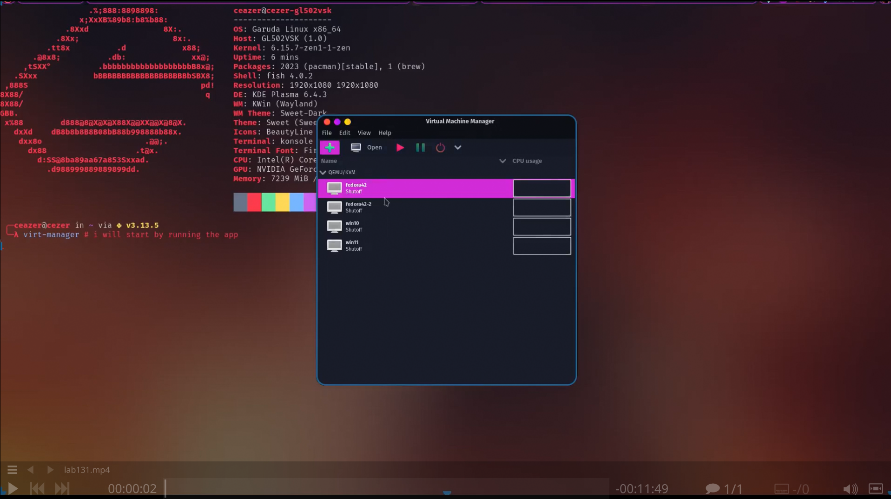
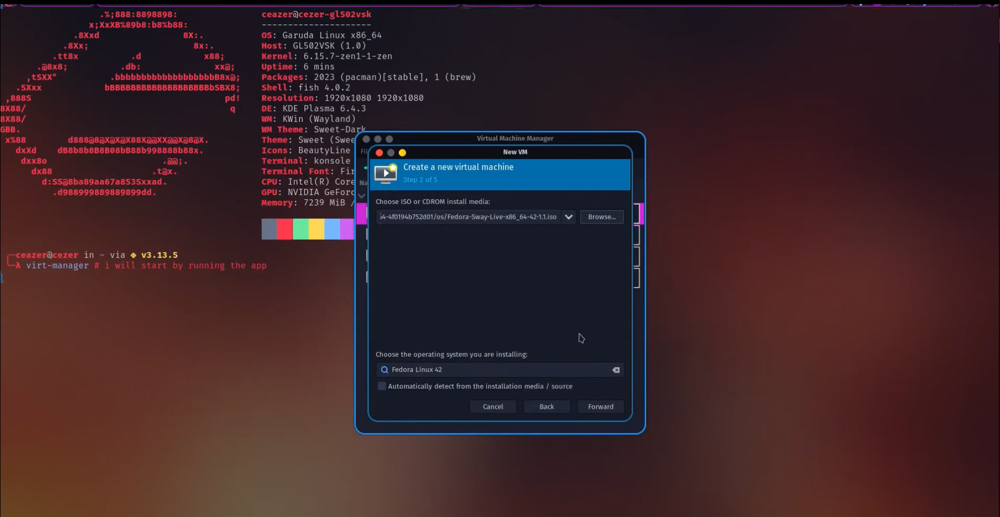

## Установка операционной системы

Запускаю виртуальную машину и запускаю установку операционной системы Fedora 42. Выбираю язык интерфейса и перехожу к настройкам установки операционной системы.

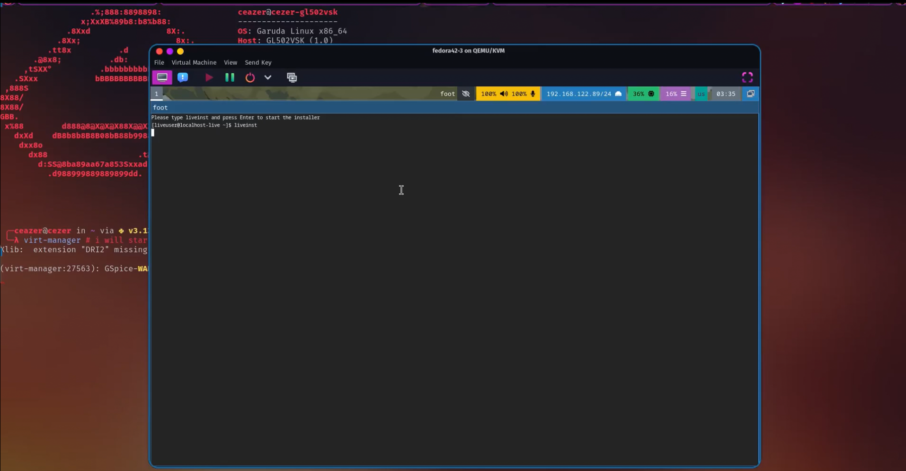
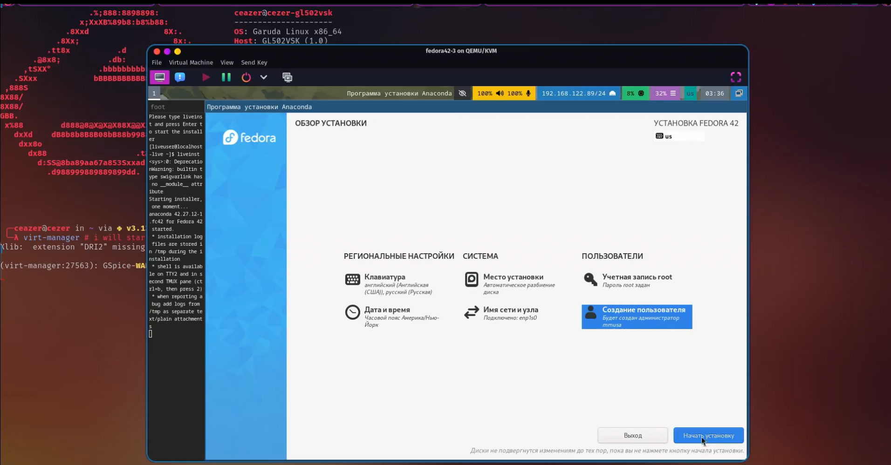

## Установка драйверов для VirtualBox

после завершения загрузки я загрузил необходимые драйверы.
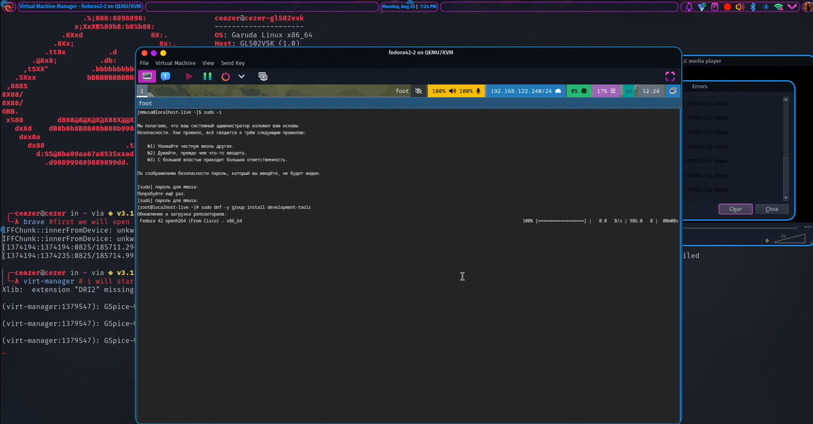
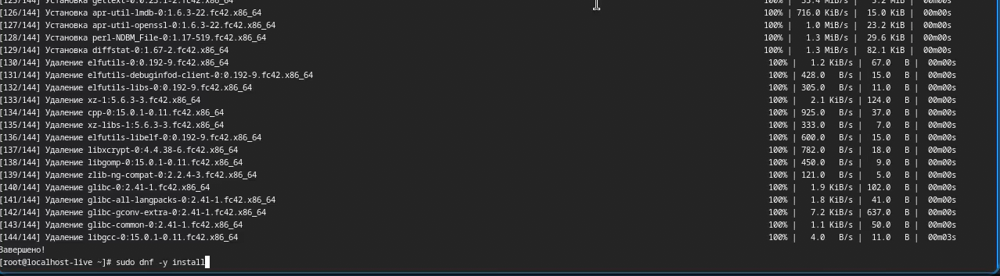
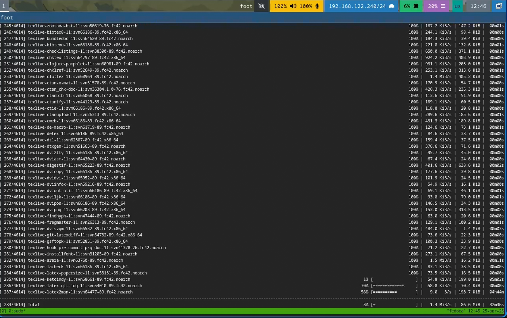

## Настройка раскладки клавиатуры
Я настраиваю клавиатуру на английскую и русскую раскладку.
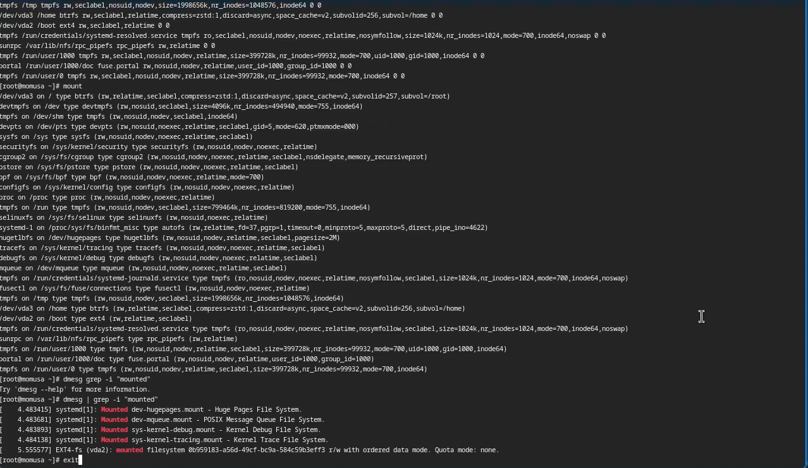
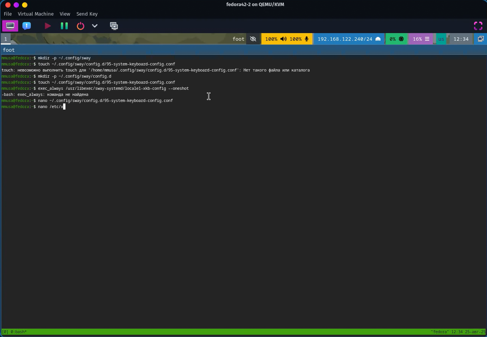

# Выводы

При выполнении проделанной работы я приобретела практические навыки установки операционной системы на виртуальную машину, настройки минимально необходимых для дальнейшей работы сервисов.

# Дополнительное задание

В окне терминала проанализирую последовательность загрузки системы, выполнив команду dmesg:

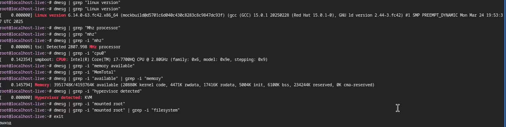
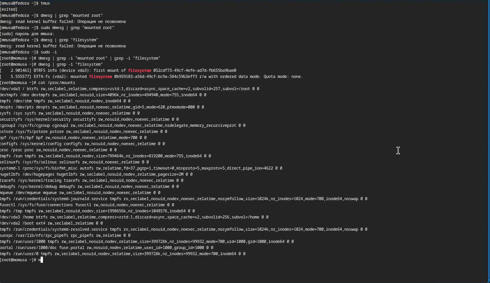

