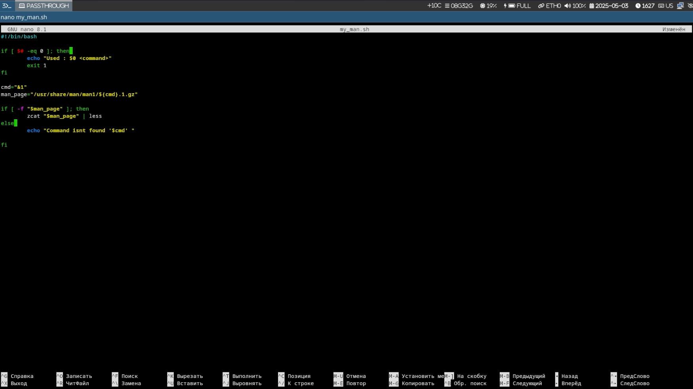
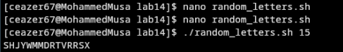
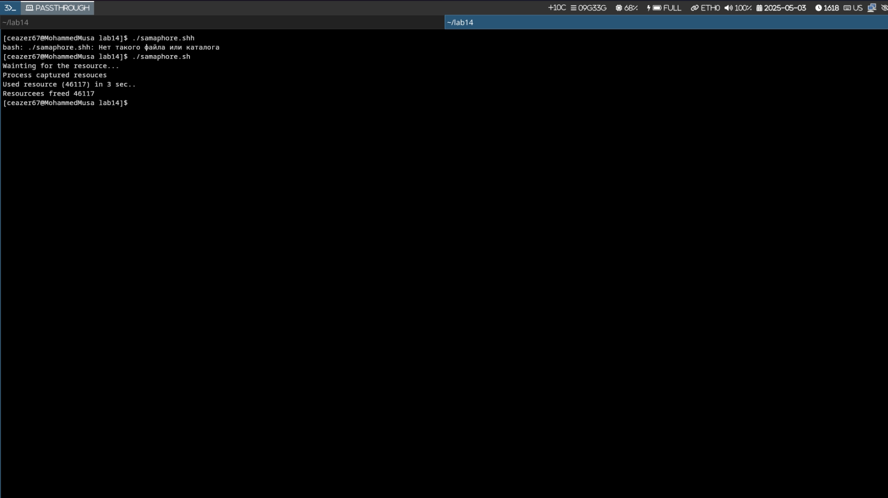

# Отчет по файлам Лабораторной работы 14
## Mohammed musa
## 1032248286 
Этот отчет предоставляет обзор скриптов оболочки и соответствующих изображений вывода, найденных в каталоге лабораторной работы.

## 1. my_man.sh

```bash
#!/bin/bash

if [ $# -eq 0 ]; then 
    echo "Used : $0 <command>"
    exit 1
fi

cmd="$1"
man_page="/usr/share/man/man1/${cmd}.1.gz"

if [ -f "$man_page" ]; then
    zcat "$man_page" | less
else 
    echo "Command isnt found '$cmd' "
fi
```

**Назначение**: Этот скрипт представляет собой упрощенный просмотрщик страниц руководства. Он принимает имя команды в качестве аргумента и отображает ее man-страницу, если она существует.

**Функциональность**:
- Проверяет, предоставлен ли аргумент команды
- Ищет страницу руководства в стандартном месте (/usr/share/man/man1/)
- Если найдено, использует `zcat` для распаковки и `less` для отображения страницы руководства
- В противном случае отображает сообщение об ошибке

**Демонстрация**:



## 2. random_letters.sh

```bash
#!/bin/bash

length=${1:-10}

generate_letter() {
    rand=$(( RANDOM % 26 ))
    printf "\\x$(printf %02x $((65 + rand)))"
}

result=""
for ((i=0; i<length; i++)); do  
    result+=$(generate_letter)
done

echo $result
```

**Назначение**: Генерирует случайную строку из заглавных букв.

**Функциональность**:
- Принимает необязательный аргумент для длины строки (по умолчанию 10)
- Использует функцию для генерации случайных заглавных букв ASCII
- Объединяет буквы в результирующую строку
- Выводит случайную строку

**Демонстрация**:



На изображении показано, как скрипт генерирует случайные заглавные буквы. Скрипт можно использовать с аргументом для указания длины случайной строки.

## 3. samaphore.sh

```bash
#!/bin/bash

# variables
t1=5
t2=3
sem_file="/tmp/semaphore.lock"

# our function 
wait_for_semaphore() {
    echo "Wainting for the resource..."
    while [ -f "$sem_file" ] && [ $t1 -gt 0  ]; do
        sleep 1
        ((t1--))
    done
    if [ ! -f "$sem_file" ]; then 
        touch "$sem_file"
        echo "Process captured resouces"
        return 0
    else
        echo " Couldnt capture the resouces"
        exit 1
    fi
}

# capturing resources 
wait_for_semaphore

# usinng the resources
echo "Used resource ($$) in $t2 sec.."
sleep $t2

# freeing resourcces
rm "$sem_file"
echo "Resourcees freed $$" 
```

**Назначение**: Демонстрирует базовую реализацию семафора в bash для управления ресурсами.

**Функциональность**:
- Использует файл блокировки (/tmp/semaphore.lock) в качестве семафора
- Реализует механизм ожидания с таймаутом (5 секунд)
- Когда процесс получает ресурс, он создает файл блокировки
- Процесс использует ресурс в течение указанного времени (3 секунды)
- После использования ресурса удаляет файл блокировки для освобождения ресурса
- Включает ID процесса в выходные сообщения для идентификации

**Демонстрация**:



На изображении показано выполнение скрипта семафора, демонстрирующее, как процессы ожидают и получают ресурсы с использованием механизма семафора.

## Дополнительный контент

Также есть другие PNG-файлы, которые показывают различные запуски или аспекты скриптов:

1. **contentrandom.png** - Показывает дополнительный вывод из скрипта случайных букв
2. **samapohore.png** - Показывает еще одно выполнение скрипта семафора

## Резюме

Эта лабораторная работа, по-видимому, сосредоточена на написании скриптов bash с тремя основными примерами:
1. Пользовательский просмотрщик страниц руководства
2. Генератор случайных букв
3. Базовая реализация семафора для управления ресурсами

Каждый скрипт демонстрирует различные концепции программирования в bash:
- Обработка файлов и выполнение команд (my_man.sh)
- Генерация случайных чисел и манипуляции со строками (random_letters.sh)
- Синхронизация процессов и управление ресурсами (samaphore.sh)

PNG-файлы предоставляют визуальные доказательства выполнения и вывода скриптов, помогая понять их функциональность.
