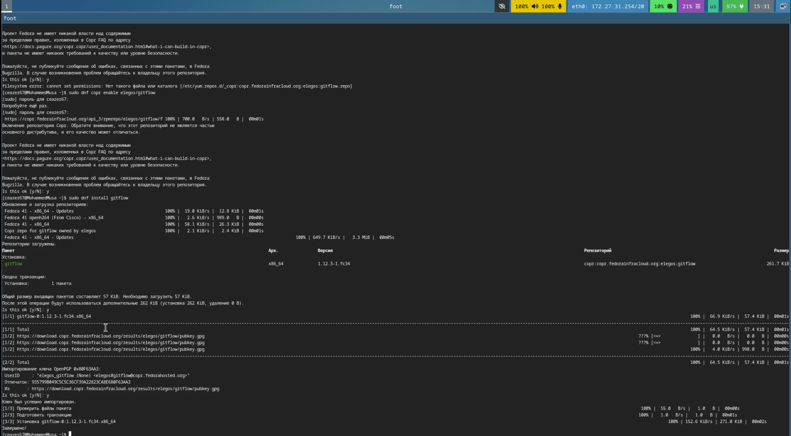
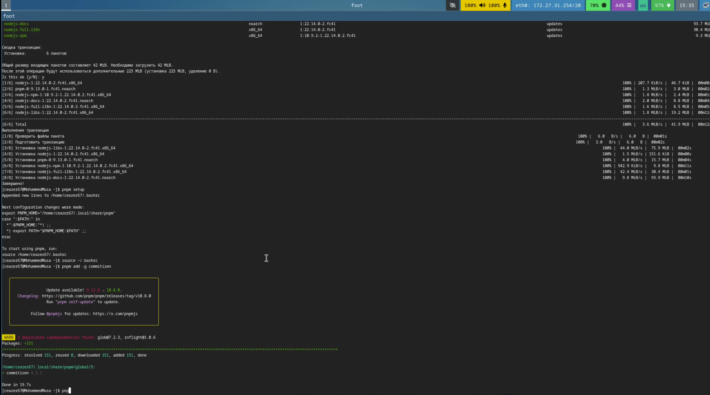
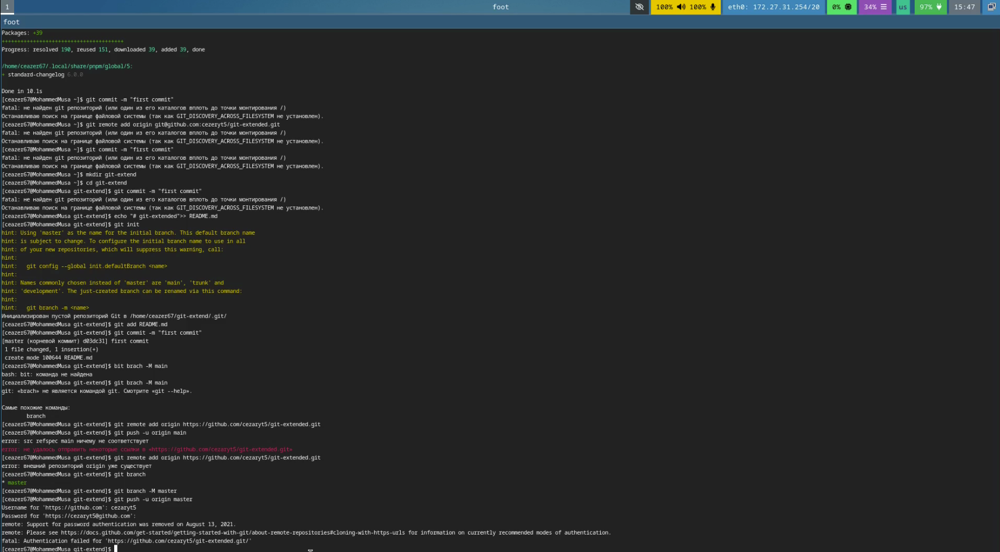
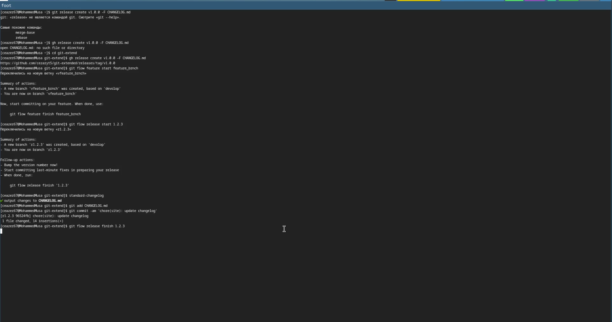
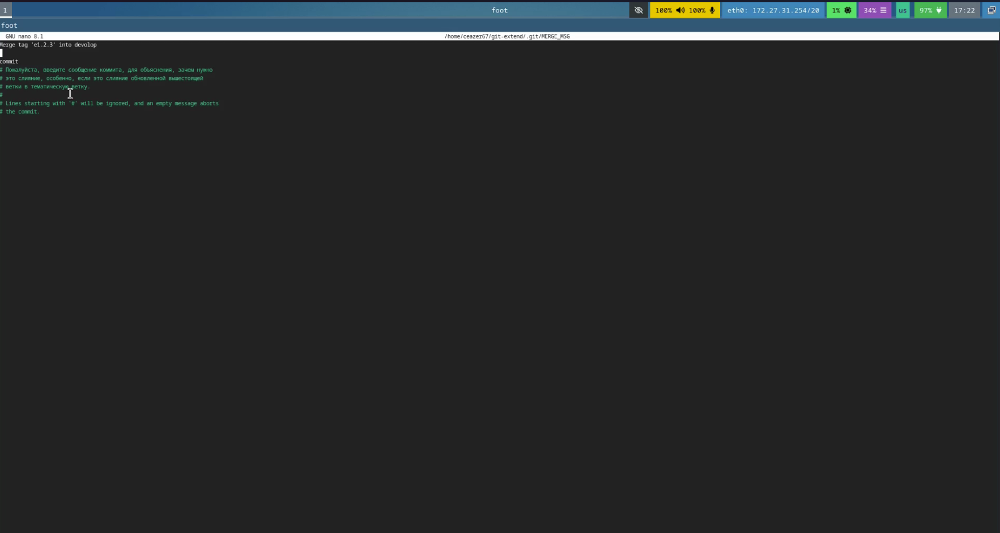
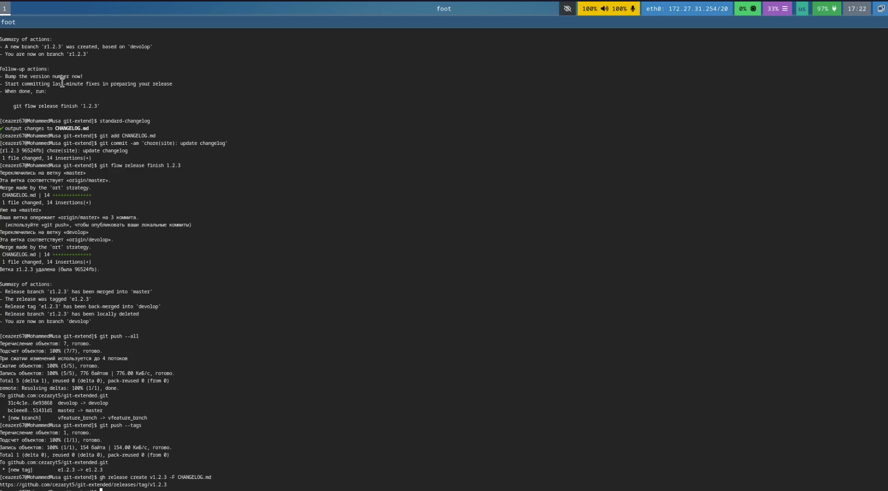

# Лабораторная работа №4  
## Выполнил: Кулябов Д. С., имя: Мохамед Муса  

## Установка программного обеспечения

### Установка git-flow Linux (Fedora)

Установка из коллекции репозиториев Copr (https://copr.fedorainfracloud.org/coprs/elegos/gitflow/):

```bash
# Enable the copr repository
sudo dnf copr enable elegos/gitflow
# Install gitflow
sudo dnf install gitflow
```

### Установка Node.js

На Node.js базируется программное обеспечение для семантического версионирования и общепринятых коммитов.

```bash
sudo dnf install nodejs
sudo dnf install pnpm
```

### Настройка Node.js

Для работы с Node.js добавим каталог с исполняемыми файлами, устанавливаемыми yarn, в переменную PATH.

```bash
pnpm setup
# После выполнения, перелогиньтесь или выполните:
source ~/.bashrc
```

### Установка инструментов для работы с коммитами

#### commitizen

Данная программа используется для помощи в форматировании коммитов.

```bash
pnpm add -g commitizen
```

Устанавливается скрипт `git-cz` для форматирования коммитов.

#### standard-changelog

Данная программа используется для помощи в создании логов.

```bash
pnpm add -g standard-changelog
```

## Практический сценарий использования git

### Создание репозитория git

#### Подключение репозитория к GitHub

1. Создайте репозиторий на GitHub (например, `git-extended`).
2. Первоначальная настройка:

```bash
git init
git commit -m "first commit"
git remote add origin git@github.com:<username>/git-extended.git
git push -u origin main
```

### Конфигурация коммитов для Node.js проектов

1. Инициализация проекта:

```bash
pnpm init
```

2. Пример конфигурации в `package.json`:

```json
{
  "name": "git-extended",
  "version": "1.0.0",
  "description": "Git repo for educational purposes",
  "main": "index.js",
  "repository": "git@github.com:username/git-extended.git",
  "author": "Name Surname <username@gmail.com>",
  "license": "CC-BY-4.0",
  "config": {
    "commitizen": {
      "path": "cz-conventional-changelog"
    }
  }
}
    }
  }
}
```

3. Добавление файлов и коммит:

```bash
git add .
git cz
git push
```

### Настройка git-flow

1. Инициализация git-flow:

```bash
git flow init
# Установите префикс для ярлыков (например, v)
```

2. Проверка ветки и настройка:

```bash
git branch
git push --all
git branch --set-upstream-to=origin/develop develop
```

3. Создание релиза 1.0.0:

```bash
git flow release start 1.0.0
git commit -m "Initial release commit"
git flow release finish 1.0.0
git push origin main --tags
```

4. Генерация changelog:

```bash
standard-changelog -v 1.0.0 -p angular -s

### Скриншоты
  
  
  
  
  
  

