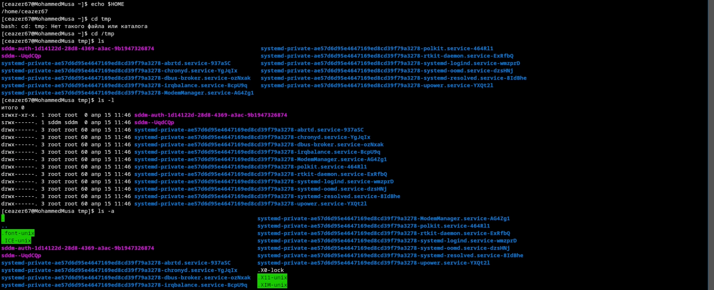
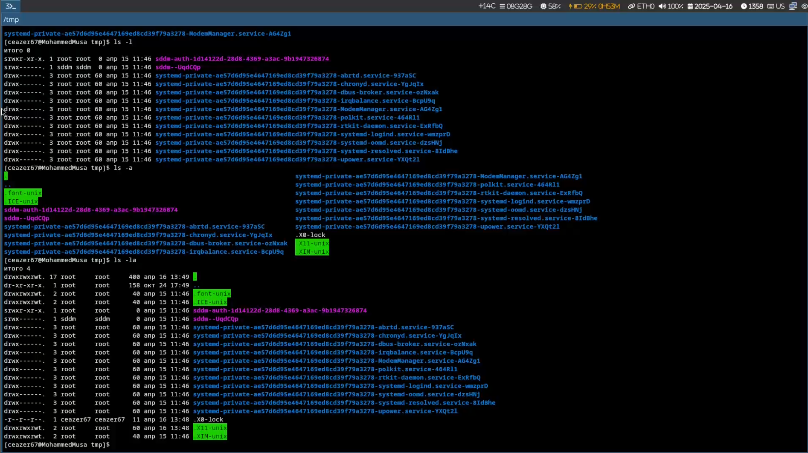
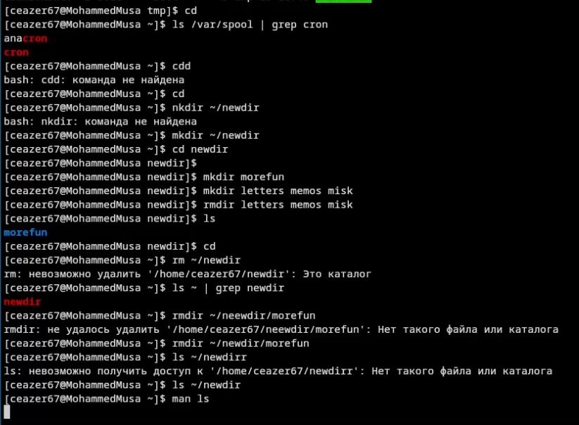
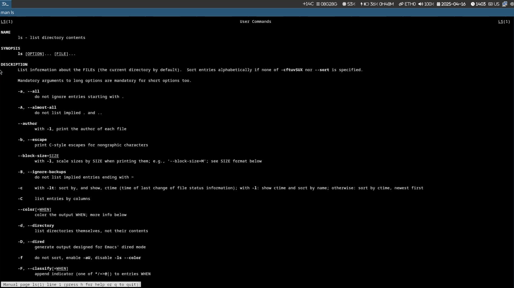
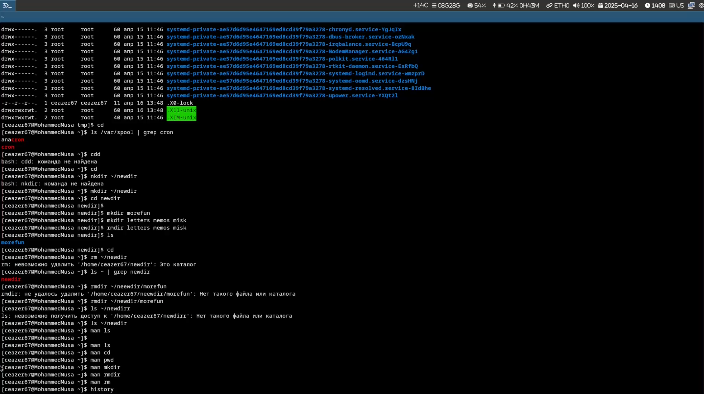
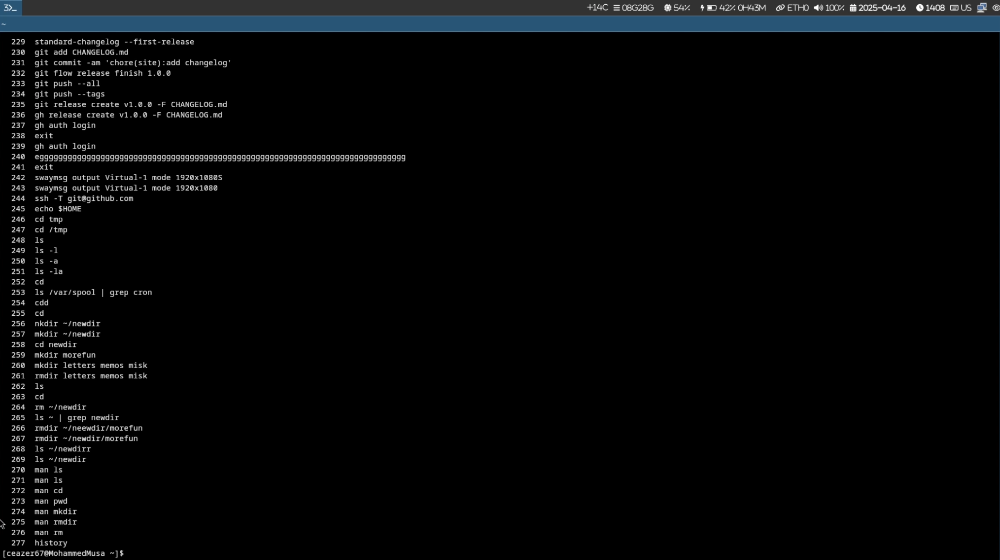

# Лабораторная работа №6  
## Выполнил: Кулябов Д. С., имя: Мохамед Муса  

## 1. Цель работы  
Изучение базовых команд оболочки для работы с каталогами и файлами.  

## 2. Результаты выполнения задания  

### 2.1 Переход в каталог /tmp  
```bash  
cd /tmp  
```  
  

### 2.2 Содержимое каталога /tmp  
```bash  
ls -l      # подробный список с правами доступа  
ls -a      # показывает скрытые файлы  
ls -la     # комбинация предыдущих опций  
```  
  

### 2.3 Проверка наличия подкаталога cron в /var/spool  
```bash  
ls -l /var/spool/cron  # подкаталог существует  
```  
  

### 2.4 Содержимое домашнего каталога  
```bash  
cd ~  
ls -l  
# Все файлы и каталоги принадлежат пользователю ceazer  
```  

### 3.1-3.3 Создание и удаление каталогов  
```bash  
mkdir newdir  
mkdir ~/newdir/morefun  
mkdir letters memos misk  
rmdir letters memos misk  
rm -r newdir  # удаление с подкаталогами  
```  

### 4. Опция ls для просмотра подкаталогов  
```bash  
ls -R  # рекурсивный вывод содержимого каталогов  
```  

### 5. Опции ls для сортировки по времени изменения  
```bash  
ls -lt  # сортировка по времени последнего изменения  
ls -l --time-style=+%H:%M  
```  

### 6. Основные опции команд  
```bash  
man cd    # смена текущего каталога  
man pwd   # вывод полного пути текущего каталога  
man mkdir # создание каталогов (-p для вложенных)  
man rmdir # удаление пустых каталогов  
man rm    # удаление файлов и каталогов (-r для рекурсивного удаления)  
```  

### 7. Использование history  
```bash  
history | tail -n 10  
!123     # повтор команды под номером 123  
!!       # повтор последней команды  
```  
  
  
  


## 3. Выводы  
Освоены базовые команды работы с файловой системой:  
- Навигация: `cd`, `pwd`  
- Просмотр содержимого: `ls` с опциями `-l`, `-a`, `-R`, `-t`  
- Управление каталогами: `mkdir`, `rmdir`, `rm -r`  
- История команд: `history`, `!n`  

## 4. Ответы на контрольные вопросы  

1. **Что такое командная строка?**  
   Интерфейс для ввода команд в виде текстовых выражений.  

2. **Как определить абсолютный путь текущего каталога?**  
   ```bash  
   pwd  
   ```  

3. **Как показать только типы файлов и их имена?**  
   ```bash  
   ls -l | awk '{print $1, $9}'  
   ```  

4. **Как отобразить скрытые файлы?**  
   ```bash  
   ls -a  
   ```  

5. **Как удалить файл и каталог?**  
   ```bash  
   rm file.txt  
   rm -r directory_name  
   ```  

6. **Как посмотреть историю команд?**  
   ```bash  
   history  
   ```  

7. **Как использовать историю для модифицированного выполнения?**  
   ```bash  
   !123:s/old/new/  
   ```  

8. **Пример запуска нескольких команд в одной строке**  
   ```bash  
   mkdir test && cd test || echo "Ошибка"  
   ```  

9. **Символы экранирования**  
   ```bash  
   echo "Hello \$USER"  # $USER не интерпретируется  
   ```  

10. **Информация ls -l**  
    Права, количество жестких ссылок, владелец, группа, размер, дата, имя.  

11. **Относительный путь**  
    ```bash  
    cd labs/lab6  # относительно текущего каталога  
    cd ../../lab6 # относительный путь из подкаталога  
    ```  

12. **Информация об команде**  
    ```bash  
    man ls  
    ```  

13. **Автодополнение команд**  
    Клавиша `Tab` для автодополнения имен файлов/команд.
