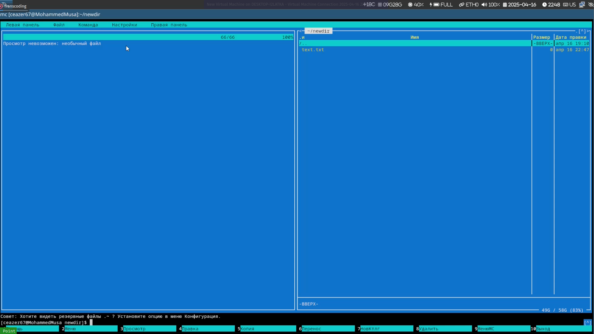
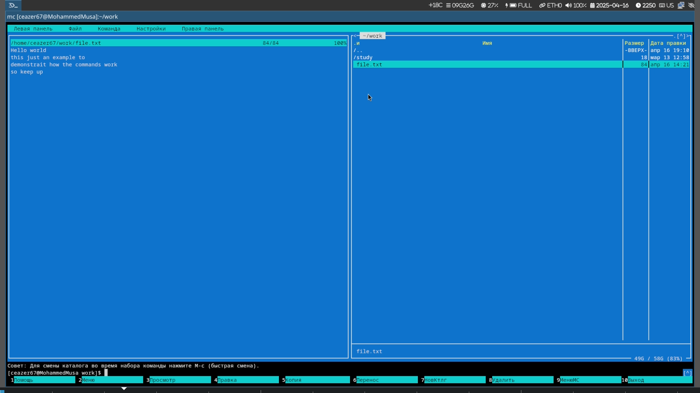
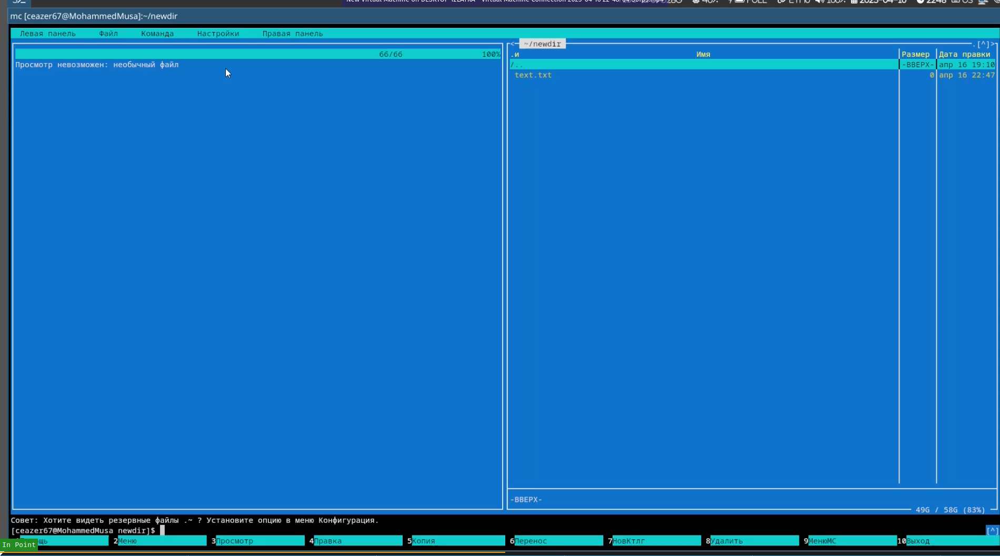
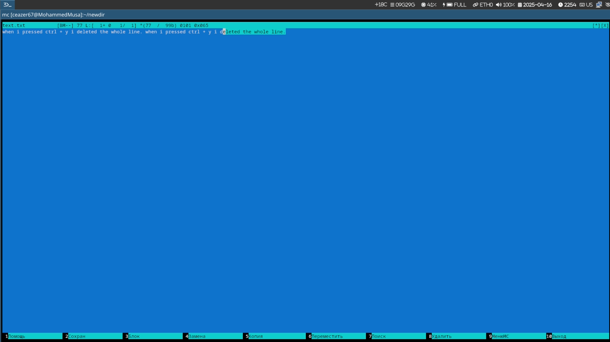

# Лабораторная работа №9  
## Выполнил: Муса Мохамед  

### 1. Цель работы  
Изучение возможностей Midnight Commander (mc) для работы с файлами, каталогами и встроенным редактором.

### 2. Последовательность выполнения работы  
#### 7.3.1. Задание по mc  
1. **Изучение mc через man**:  
   ```bash
   man mc
   ```  
2. **Запуск mc и исследование интерфейса**:  
   ```bash
   mc
   ```  
   - Структура: две панели, строка меню, командная строка.  
   - Меню: File, Command, Options, Right, Left, Info, Help.  

3. **Операции в mc**:  
   - Управление панелями: `F9` → `Left/Right` → `List` → смена каталога.  
   - Выделение файлов: `Insert` (для выделения), `F5` (копирование), `F6` (перемещение).  
   - Информация о файлах: `F10` → `Info` → `File` → `Properties`.  

4. **Использование меню панелей**:  
   - Копирование файлов между панелями через `F5`.  
   - Просмотр подробной информации: `F10` → `View` → `Long format`.  

5. **Подменю "Файл"**:  
   - Просмотр содержимого: `F3` (View).  
   - Редактирование: `F4` (Edit) → внесение изменений без сохранения.  
   - Создание каталога: `F7` → ввод имени.  
   - Копирование файлов в новый каталог: выделение → `F5` → выбор целевого каталога.  

6. **Подменю "Команда"**:  
   - Поиск файла с `main` в `.c`/`.cpp`: `F9` → `Command` → `Find file` → параметры: `*.c` и содержимое `main`.  
   - Повтор команды: `F9` → `Command` → `History`.  
   - Переход в домашний каталог: `F9` → `Command` → `Go to` → `Home`.  
   - Анализ файлов меню: `F9` → `Command` → `Edit extension file`.  

7. **Настройки mc**:  
   - Режимы отображения: `F9` → `Options` → `Layout` → Full screen, Double width.  
   - Отображение скрытых файлов: `F9` → `Options` → `Panel` → `Show hidden files`.  

#### 7.3.2. Задание по встроенному редактору mc  
1. **Создание файла**:  
   ```bash
   mc
   F9 → File → New file → text.txt
   ```  
2. **Редактирование через mc**:  
   - Вставка текста: `Ctrl+Ins` (копирование из другого файла).  
   - Удаление строки: `Ctrl+Y`.  
   - Выделение фрагмента: `F3` (начало выделения) → `F3` (окончание) → `F5` (копирование) или `F6` (перемещение).  
   - Сохранение: `F2`.  
   - Отмена: `Ctrl+U`.  
   - Навигация: `Alt+End` (в конец файла), `Alt+Home` (в начало).  

3. **Подсветка синтаксиса**:  
   - Открытие файла `.c`/`.java`: `F4` → выбор файла.  
   - Включение/выключение: `F9` → `Options` → `Syntax highlighting`.  

### 3. Выводы  
В ходе работы освоены:  
- Навигация и управление файлами в mc.  
- Поиск файлов с условиями через `Find file`.  
- Редактирование текста и кода с подсветкой синтаксиса.  
- Настройка интерфейса mc под задачи пользователя.  

### 4. Ответы на контрольные вопросы  
1. **Режимы mc**:  
   - **Shell-режим**: Основной интерфейс с двумя панелями для навигации по файловой системе, строкой меню и командной строкой.  
   - **Редактор**: Активируется через `F4`, поддерживает синтаксис подсветку, поиск/замена, отмену изменений (`Ctrl+U`).  
   - **Просмотр**: Активируется через `F3`, позволяет читать содержимое файлов без редактирования, поддерживает поиск (`F7`).  

2. **Операции с файлами**:  
   - **Копирование**:  
     - В mc: `F5` → интерактивный выбор целевого каталога.  
     - В shell: `cp source destination` с опциями `-r` для каталогов.  
   - **Перемещение**:  
     - В mc: `F6` → перенос с подтверждением.  
     - В shell: `mv source destination` для переименования/перемещения.  
   - **Удаление**:  
     - В mc: `F8` → безопасное удаление с подтверждением.  
     - В shell: `rm file` или `rm -r directory` для рекурсивного удаления.  

3. **Меню панели mc**:  
   - **`Left/Right`**: Переключение между панелями и управление их содержимым (сортировка, фильтрация).  
   - **`Info`**: Отображение метаданных файла (размер, права, дата модификации).  
   - **`Help`**: Справка по горячим клавишам и базовым операциям.  
   - **`List`**: Список файлов в текущем каталоге с фильтрацией по расширению/имени.  
   - **`New`**: Создание новых файлов/каталогов.  

4. **Меню "Файл"**:  
   - **`View`**: Чтение содержимого файла с возможностью поиска (`F7`) и перехода к строке (`Ctrl+G`).  
   - **`Edit`**: Редактирование с поддержкой горячих клавиш (удаление строки `Ctrl+Y`, выделение `F3` → `F3`, сохранение `F2`).  
   - **`Copy to...`**: Копирование с настройкой параметров (перезапись, рекурсия, фильтрация).  
   - **`Move to...`**: Перемещение с аналогичными настройками.  
   - **`Delete`**: Удаление с подтверждением.  

5. **Меню "Команда"**:  
   - **`Find file`**: Поиск файлов по маске имени, содержимому, размеру и другим критериям.  
   - **`Execute`**: Запуск shell-команд внутри mc (например, `gcc file.c` для компиляции).  
   - **`History`**: Повтор ранее выполненных команд через `F9` → `Command` → `History`.  
   - **`User menu`**: Вызов пользовательских скриптов, привязанных к файлам.  

6. **Меню "Настройки"**:  
   - **`Layout`**: Настройка отображения (Full screen, Double width, Horizontal layout).  
   - **`Panel`**: Управление сортировкой файлов, отображением скрытых файлов (`Show hidden files`), цветовой схемой.  
   - **`Confirmations`**: Настройка подтверждения для удаления/перезаписи файлов.  
   - **`Options`**: Глобальные настройки mc (язык, кодировка, поведение панелей).  

7. **Встроенные команды mc**:  
   - **`F5`**: Копирование с интерактивным выбором целевого каталога и настройкой параметров (перезапись, рекурсия).  
   - **`F6`**: Перемещение с перезаписью существующих файлов и обновлением панели.  
   - **`F8`**: Удаление выделенных файлов с подтверждением.  
   - **`F2`**: Сохранение изменений в редакторе.  
   - **`F10`**: Выход из mc или завершение редактирования.  

8. **Команды редактора mc**:  
   - **`F2`**: Сохранение текущего файла без выхода.  
   - **`F3`**: Поиск текста с поддержкой регулярных выражений (например, `main\(\)` для поиска функции main).  
   - **`F4`**: Замена текста с интерактивным подтверждением каждого совпадения.  
   - **`Ctrl+Y`**: Удаление текущей строки.  
   - **`Ctrl+K`**: Вырезание строки в буфер.  
   - **`Ctrl+U`**: Вставка содержимого буфера обмена.  

9. **Пользовательские меню**:  
   - Настройка через `F9` → `Options` → `Edit extension file` → редактирование файла `~/.config/mc/extension.ini`.  
   - Пример: Добавление пользовательской команды для компиляции C-файлов:  
     ```ini
     [User menu]
     c-compile=Compile with GCC, gcc %f -o %n
     ```  

10. **Действия над текущим файлом**:  
    - **`F9` → `Command` → `User actions`**: Привязка пользовательских скриптов к типам файлов через редактирование `~/.config/mc/bindings`.  
    - **Пример**: Автоматическая компиляция `.c` файлов:  
      ```bash
      # ~/.config/mc/bindings
      regex/\.c$ gcc %f -o %n
      ```  
    - **Другой пример**: Запуск Python-скриптов через `F9` → `Command` → `User actions`.  

### 5. Скриншоты  
  
  
  
  

### 6. Листинги и результаты  
> Примечание: Добавьте листинги команд и их вывод здесь.
