---
## Front matter
lang: ru-RU
title: Презентация по лабораторной работе №1
subtitle: Архитектура компьютеров и операционные системы
author:
  - Мохамед Муса
institute:
  - Российский университет дружбы народов, Москва, Россия
date: 9 Марта 2025

## i18n babel
babel-lang: russian
babel-otherlangs: english

## Formatting pdf
toc: false
toc-title: Содержание
slide_level: 2
aspectratio: 169
section-titles: true
theme: metropolis
header-includes:
 - \metroset{progressbar=frametitle,sectionpage=progressbar,numbering=fraction}
 - '\makeatletter'
 - '\beamer@ignorenonframefalse'
 - '\makeatother'
---

# Цель работы

Целью данной работы является приобретение практических навыков установки операционной системы на виртуальную машину, настройки минимально необходимых для дальнейшей работы сервисов.
---
# Задание

1. Создание виртуальной машины
2. Установка операционной системы
3. Установка драйверов для VirtualBox
4. Настройка раскладки клавиатуры

# Выполнение лабораторной работы
---
## Создание виртуальной машины

Запускаю VirtualBox и создаю новую виртуальную машину с именем "Fedora 42". Выбираю тип операционной системы "Linux" и версию "Fedora 42(64-bit)". Задаю 4049 МБ оперативной памяти и 65 ГБ дискового пространства.

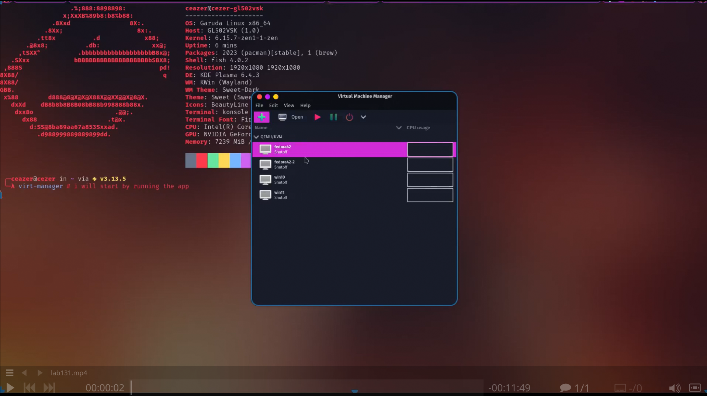
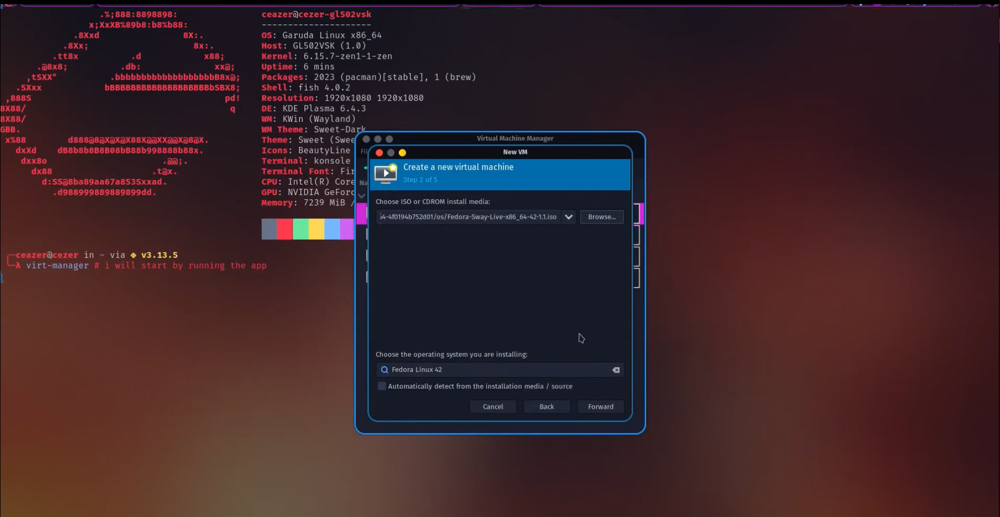
---
## Установка операционной системы

Запускаю виртуальную машину и запускаю установку операционной системы Fedora 42. Выбираю язык интерфейса и перехожу к настройкам установки операционной системы.

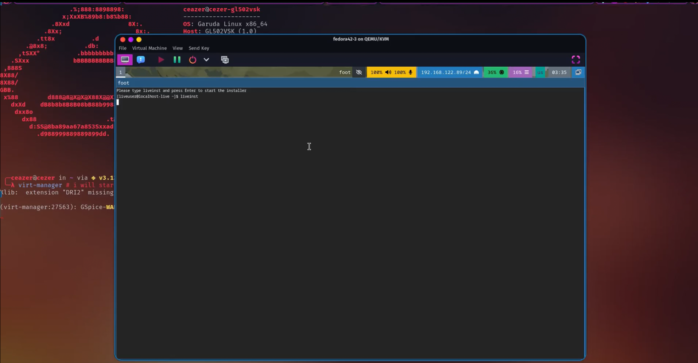
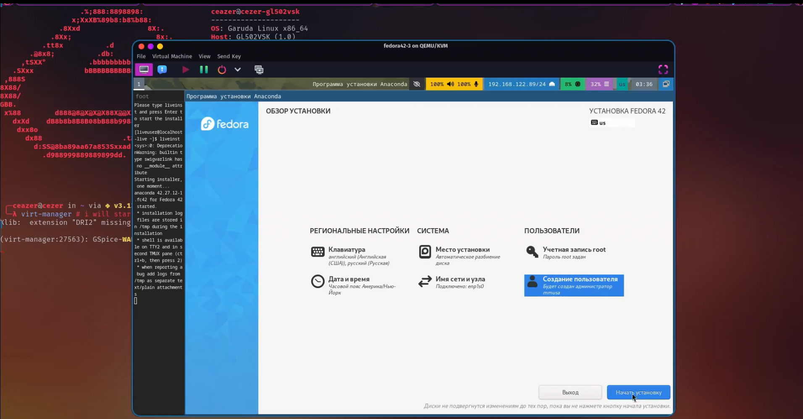
---
## Установка драйверов для VirtualBox

после завершения загрузки я загрузил необходимые драйверы.
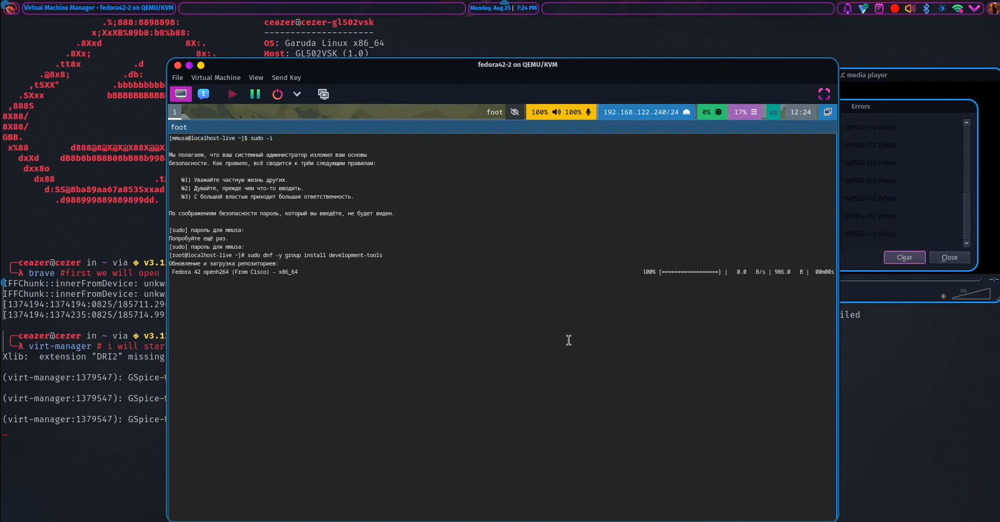
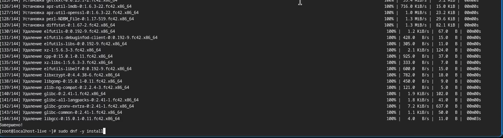
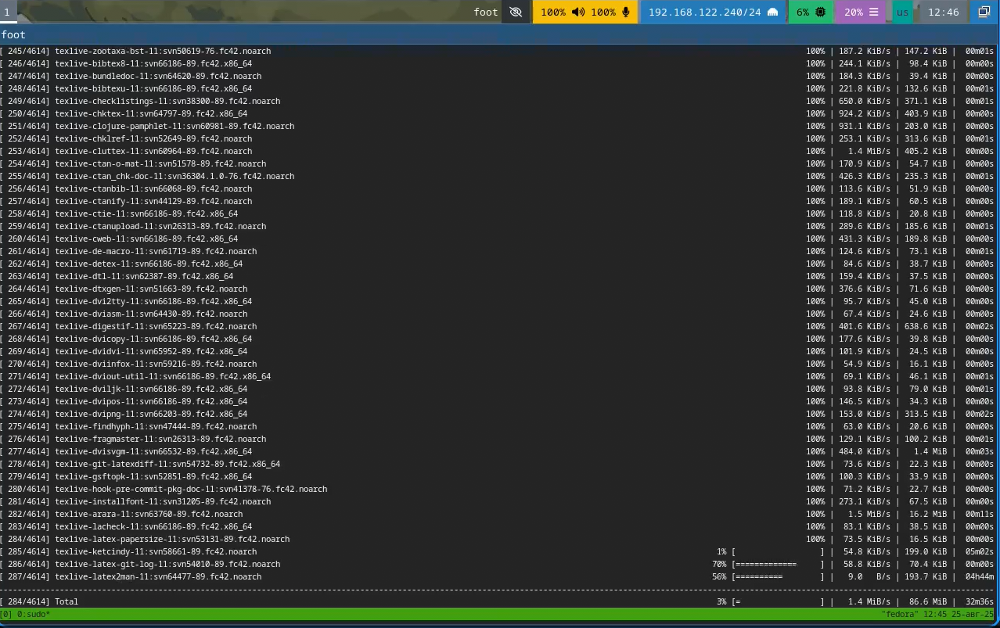

---
## Настройка раскладки клавиатуры

Я настраиваю клавиатуру на английскую и русскую раскладку.
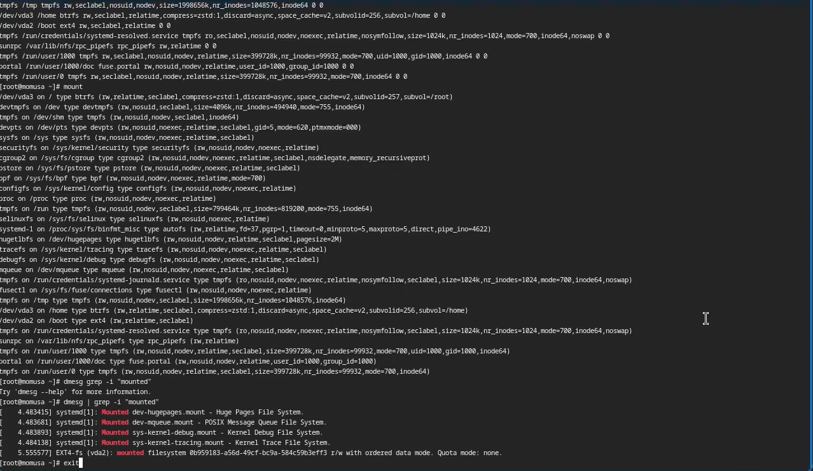
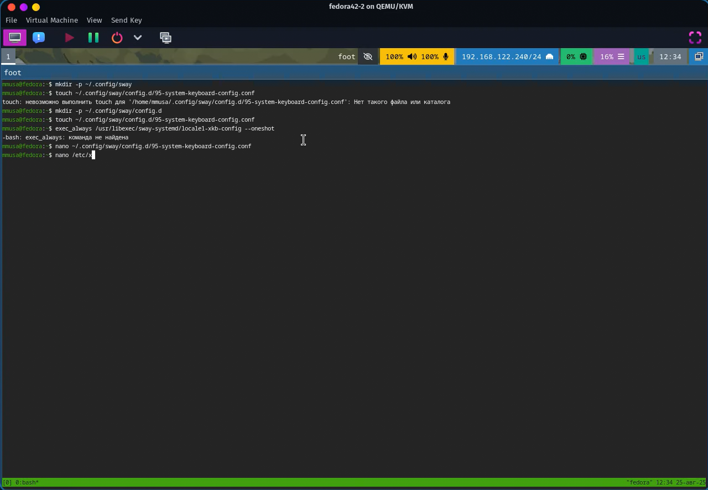

---

# Выводы

При выполнении проделанной работы я приобретела практические навыки установки операционной системы на виртуальную машину, настройки минимально необходимых для дальнейшей работы сервисов.
---

# Дополнительное задание

В окне терминала проанализирую последовательность загрузки системы, выполнив команду dmesg:

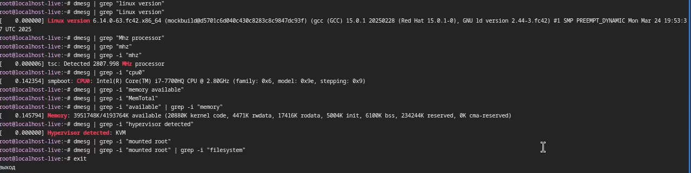
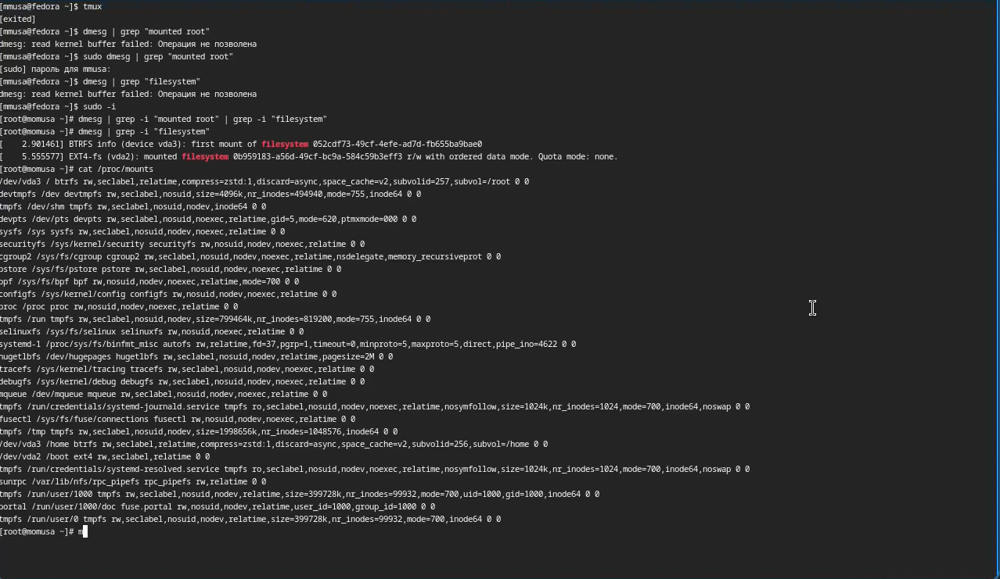

---