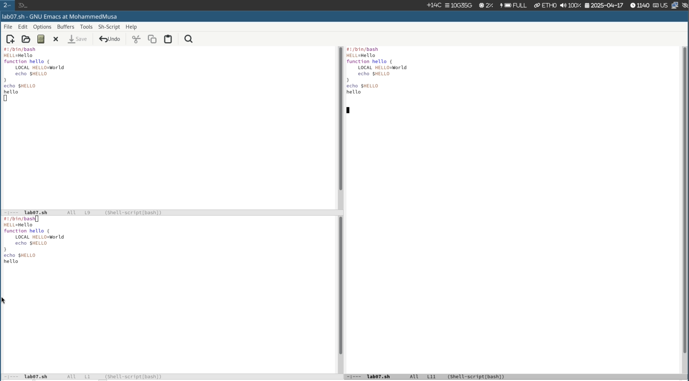
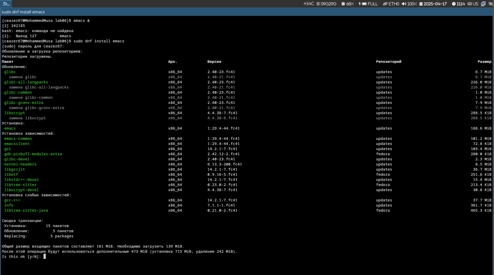

# Цель работы

Изучить базовые функции текстового редактора Emacs, включая навигацию, редактирование текста, управление буферами и окнами, а также работу с регулярными выражениями.

# Задание

1. Редактирование текста в Emacs
2. Навигация в Emacs
3. Управление буферами
4. Управление окнами
5. Работа с регулярными выражениями

# Редактирование текста

## Основные операции

- Строка удалена с помощью `C-k`
- Вставка строки в конец файла выполнена через `C-y`
- Выделение области и копирование через `C-space` + `M-w`
- Отмена действия с помощью `C-/`



# Навигация

## Перемещение курсора

- Перемещение курсора в начало строки `C-a` и в конец строки `C-e`
- Переход к началу буфера `M-<` и к концу буфера `M->`

# Управление буферами

## Основные команды

- Список буферов `C-x C-b`
- Переключение между буферами `C-x b`
- Закрытие окна `C-x 0`



# Управление окнами

## Разделение экрана

- Вертикальное разделение `C-x 3`
- Горизонтальное разделение `C-x 2`
- Работа с несколькими буферами в разделенных окнах

# Пример программы

## Листинг программы lab07.sh

```bash
#!/bin/bash
HELL=Hello
function hello {
LOCAL HELLO=World
echo $HELLO
}
echo $HELLO
hello
```

# Выводы

Emacs демонстрирует высокую гибкость и мощные возможности для редактирования текста, однако его сложная система комбинаций клавиш требует значительного времени для освоения. Работа с буферами и окнами позволяет эффективно управлять несколькими файлами одновременно.

# Контрольные вопросы

## 1. Характеристика Emacs

Emacs - это расширяемый, самодокументируемый текстовый редактор с поддержкой множества режимов и плагинов.

## 2. Сложности для новичков

- Обилие комбинаций клавиш (например, `C-x C-f` для открытия файла)
- Нетрадиционная система буферов и окон
- Отсутствие визуального выделения режимов (в отличие от vi/vim)

## 3. Буфер и окно в Emacs

- **Буфер** - это область памяти, содержащая текст файла или результат команды
- **Окно** - это визуальное отображение буфера на экране

## 4. Ограничение на буферы

Нет, количество буферов не ограничено. Буферы создаются динамически при открытии файлов или выполнении команд.

## 5. Стандартные буферы при запуске

- `*scratch*` - буфер для временного текста
- `*Messages*` - журнал системных сообщений
- `*GNU Emacs*` - стартовый экран с информацией

## 6. Ввод комбинации `C-c |`

Сначала нажать и удерживать `Ctrl`, затем последовательно нажать `c` и `|`. Для `C-c C-|` - удерживать `Ctrl`, нажать `c`, отпустить, затем снова удерживать `Ctrl` и нажать `|`.

## 7. Разделение окна

- Вертикально: `C-x 3`
- Горизонтально: `C-x 2`

## 8. Файл настроек Emacs

Конфигурационный файл: `~/.emacs.d/init.el` или `~/.emacs`

## 9. Функция клавиши `C-g`

Прерывает текущую команду или ввод. Может быть переназначена через `global-set-key` в конфигурации.

## 10. Сравнение vi и Emacs

Emacs предпочтительнее для комплексной работы (редактирование + терминал + документация), но vi имеет более логичную систему навигации и редактирования через моды.
