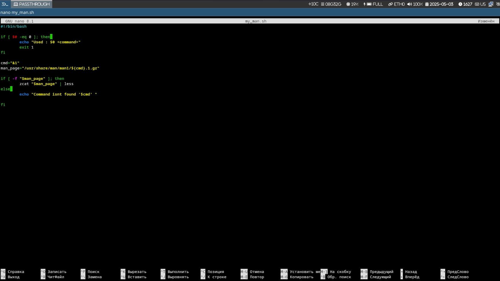
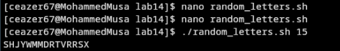
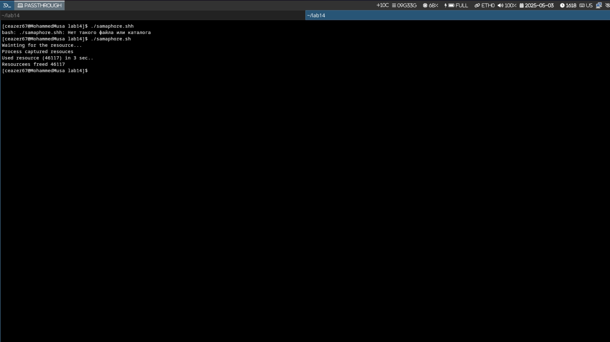

# Цель работы

Изучение скриптов оболочки и демонстрация их функциональности через практические примеры.

# Задание

1. Создание пользовательского просмотрщика страниц руководства (my_man.sh)
2. Создание генератора случайных букв (random_letters.sh)
3. Создание базовой реализации семафора (samaphore.sh)

# Пользовательский просмотрщик страниц руководства

## Код скрипта my_man.sh

```bash
#!/bin/bash

if [ $# -eq 0 ]; then 
    echo "Used : $0 <command>"
    exit 1
fi

cmd="$1"
man_page="/usr/share/man/man1/${cmd}.1.gz"

if [ -f "$man_page" ]; then
    zcat "$man_page" | less
else 
    echo "Command isnt found '$cmd' "
fi
```

## Назначение и функциональность

- **Назначение**: Упрощенный просмотрщик страниц руководства
- **Функциональность**:
  - Проверяет, предоставлен ли аргумент команды
  - Ищет страницу руководства в стандартном месте (/usr/share/man/man1/)
  - Если найдено, использует `zcat` для распаковки и `less` для отображения страницы руководства
  - В противном случае отображает сообщение об ошибке



# Генератор случайных букв

## Код скрипта random_letters.sh

```bash
#!/bin/bash

length=${1:-10}

generate_letter() {
    rand=$(( RANDOM % 26 ))
    printf "\\x$(printf %02x $((65 + rand)))"
}

result=""
for ((i=0; i<length; i++)); do  
    result+=$(generate_letter)
done

echo $result
```

## Назначение и функциональность

- **Назначение**: Генерирует случайную строку из заглавных букв
- **Функциональность**:
  - Принимает необязательный аргумент для длины строки (по умолчанию 10)
  - Использует функцию для генерации случайных заглавных букв ASCII
  - Объединяет буквы в результирующую строку
  - Выводит случайную строку



# Базовая реализация семафора

## Код скрипта samaphore.sh

```bash
#!/bin/bash

# variables
t1=5
t2=3
sem_file="/tmp/semaphore.lock"

# our function 
wait_for_semaphore() {
    echo "Wainting for the resource..."
    while [ -f "$sem_file" ] && [ $t1 -gt 0  ]; do
        sleep 1
        ((t1--))
    done
    if [ ! -f "$sem_file" ]; then 
        touch "$sem_file"
        echo "Process captured resouces"
        return 0
    else
        echo " Couldnt capture the resouces"
        exit 1
    fi
}

# capturing resources 
wait_for_semaphore

# usinng the resources
echo "Used resource ($$) in $t2 sec.."
sleep $t2

# freeing resourcces
rm "$sem_file"
echo "Resourcees freed $$" 
```

## Назначение и функциональность

- **Назначение**: Демонстрирует базовую реализацию семафора в bash для управления ресурсами
- **Функциональность**:
  - Использует файл блокировки (/tmp/semaphore.lock) в качестве семафора
  - Реализует механизм ожидания с таймаутом (5 секунд)
  - Когда процесс получает ресурс, он создает файл блокировки
  - Процесс использует ресурс в течение указанного времени (3 секунды)
  - После использования ресурса удаляет файл блокировки для освобождения ресурса
  - Включает ID процесса в выходные сообщения для идентификации



# Дополнительные демонстрации

## Другие изображения

Также есть другие PNG-файлы, которые показывают различные запуски или аспекты скриптов:

1. **contentrandom.png** - Показывает дополнительный вывод из скрипта случайных букв
2. **samapohore.png** - Показывает еще одно выполнение скрипта семафора

# Резюме

## Основные концепции программирования в bash

Эта лабораторная работа сосредоточена на написании скриптов bash с тремя основными примерами:

1. **Обработка файлов и выполнение команд** (my_man.sh)
2. **Генерация случайных чисел и манипуляции со строками** (random_letters.sh)
3. **Синхронизация процессов и управление ресурсами** (samaphore.sh)

## Визуальные доказательства

PNG-файлы предоставляют визуальные доказательства выполнения и вывода скриптов, помогая понять их функциональность.
