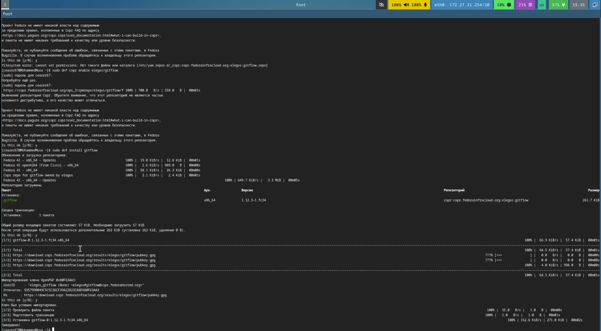
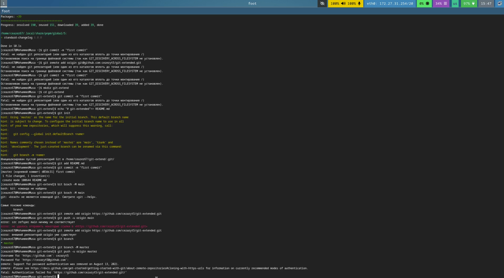
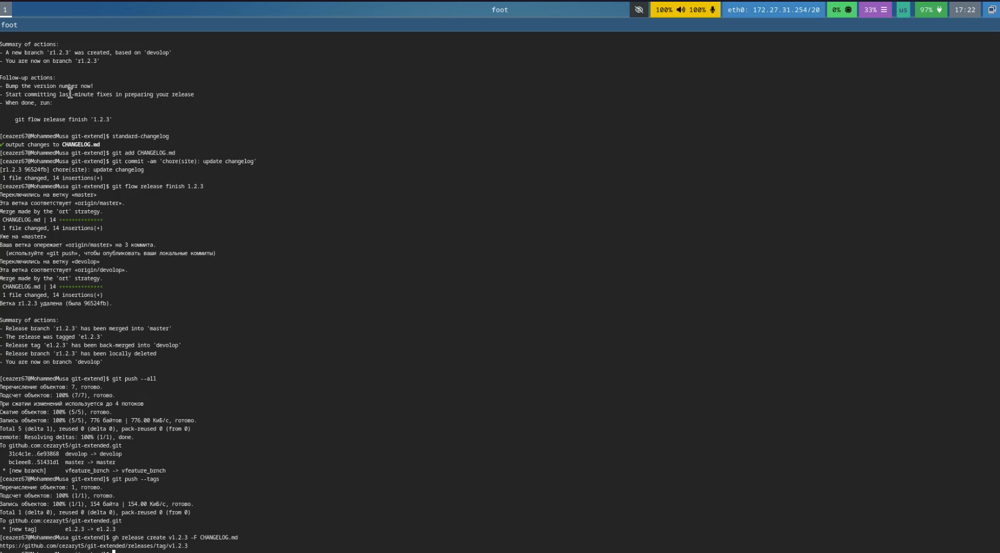
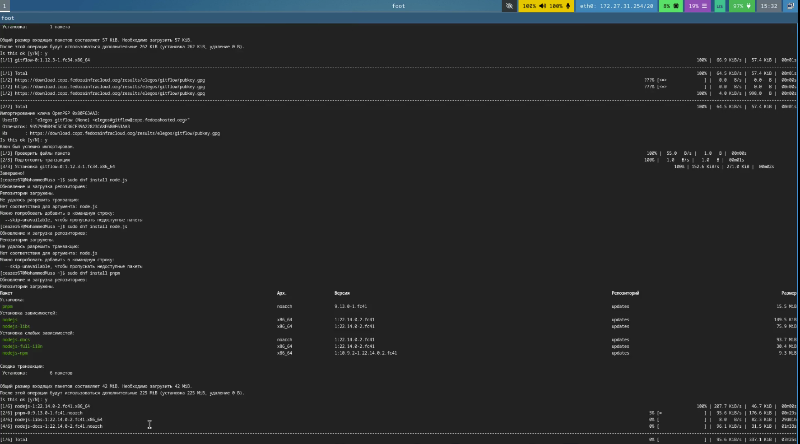
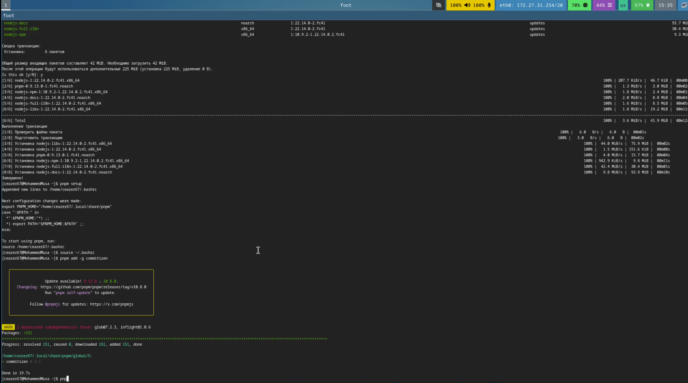
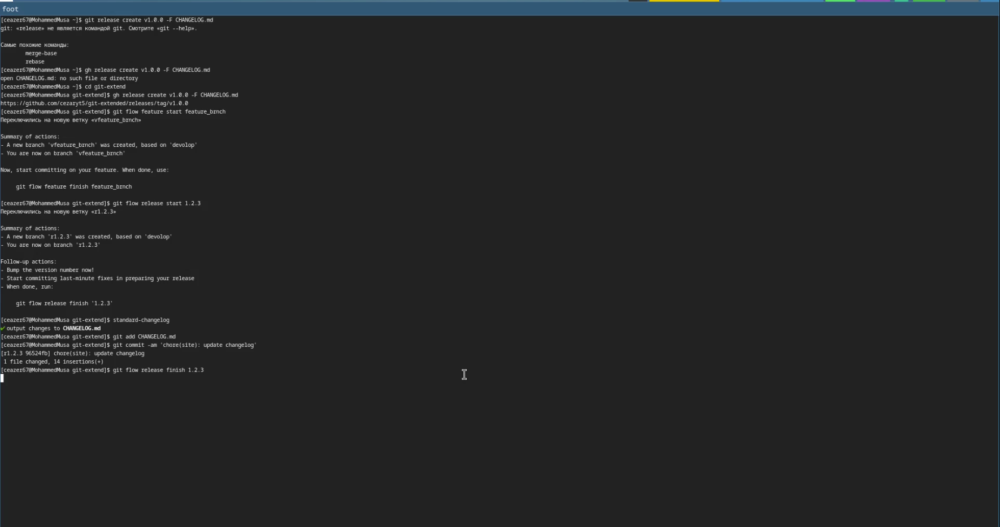
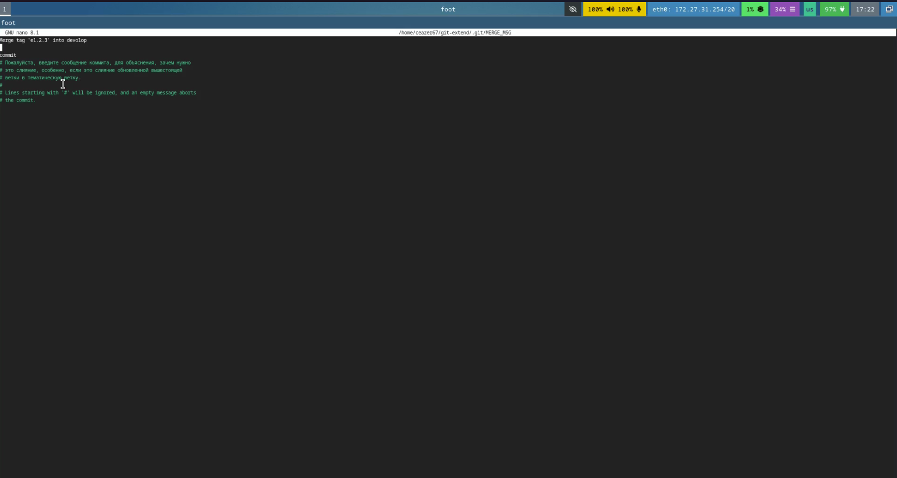

---
## Front matter
lang: ru-RU
title: Презентация по лабораторной работе №4
subtitle: Архитектура компьютеров и операционные системы
author:
  - Мохамед Муса
institute:
  - Российский университет дружбы народов, Москва, Россия
date: 29 августа 2025

## i18n babel
babel-lang: russian
babel-otherlangs: english

## Formatting pdf
toc: false
toc-title: Содержание
slide_level: 2
aspectratio: 169
section-titles: true
theme: metropolis
header-includes:
 - \metroset{progressbar=frametitle,sectionpage=progressbar,numbering=fraction}
 - '\makeatletter'
 - '\beamer@ignorenonframefalse'
 - '\makeatother'
---

# Цель работы

Целью данной работы является приобретение практических навыков работы с расширенными возможностями git, включая установку необходимого программного обеспечения, настройку инструментов для работы с коммитами и использование git-flow.

# Задание

1. Установка необходимого программного обеспечения
2. Настройка инструментов для работы с коммитами
3. Практический сценарий использования git
4. Настройка и использование git-flow

# Установка программного обеспечения

## Установка git-flow Linux (Fedora)

Установка из коллекции репозиториев Copr:

```bash
# Enable the copr repository
sudo dnf copr enable elegos/gitflow
# Install gitflow
sudo dnf install gitflow
```



## Установка Node.js

На Node.js базируется программное обеспечение для семантического версионирования и общепринятых коммитов.

```bash
sudo dnf install nodejs
sudo dnf install pnpm
```

## Настройка Node.js

Для работы с Node.js добавим каталог с исполняемыми файлами в переменную PATH.

```bash
pnpm setup
# После выполнения, перелогиньтесь или выполните:
source ~/.bashrc
```

# Инструменты для работы с коммитами

## commitizen

Данная программа используется для помощи в форматировании коммитов.

```bash
pnpm add -g commitizen
```

Устанавливается скрипт `git-cz` для форматирования коммитов.



## standard-changelog

Данная программа используется для помощи в создании логов.

```bash
pnpm add -g standard-changelog
```

# Практический сценарий использования git

## Создание репозитория git

1. Создайте репозиторий на GitHub (например, `git-extended`).
2. Первоначальная настройка:

```bash
git init
git commit -m "first commit"
git remote add origin git@github.com:<username>/git-extended.git
git push -u origin main
```

## Конфигурация коммитов для Node.js проектов

1. Инициализация проекта:

```bash
pnpm init
```

2. Пример конфигурации в `package.json`:

```json
{
  "name": "git-extended",
  "version": "1.0.0",
  "description": "Git repo for educational purposes",
  "main": "index.js",
  "repository": "git@github.com:username/git-extended.git",
  "author": "Name Surname <username@gmail.com>",
  "license": "CC-BY-4.0",
  "config": {
    "commitizen": {
      "path": "cz-conventional-changelog"
    }
  }
}
```

3. Добавление файлов и коммит:

```bash
git add .
git cz
git push
```

# Настройка git-flow

## Инициализация git-flow

```bash
git flow init
# Установите префикс для ярлыков (например, v)
```



## Проверка ветки и настройка

```bash
git branch
git push --all
git branch --set-upstream-to=origin/develop develop
```

## Создание релиза 1.0.0

```bash
git flow release start 1.0.0
git commit -m "Initial release commit"
git flow release finish 1.0.0
git push origin main --tags
```




## Генерация changelog

```bash
standard-changelog -v 1.0.0 -p angular -s
```




# Выводы

При выполнении данной лабораторной работы были приобретены практические навыки работы с расширенными возможностями git, включая:

- Установку необходимого программного обеспечения
- Настройку инструментов для работы с коммитами
- Практическое применение git в проектах
- Настройку и использование git-flow для управления ветвлением
- Генерацию логов изменений
