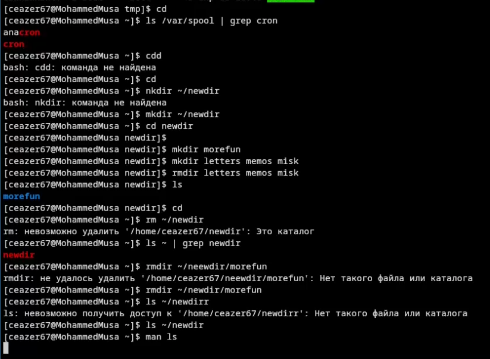
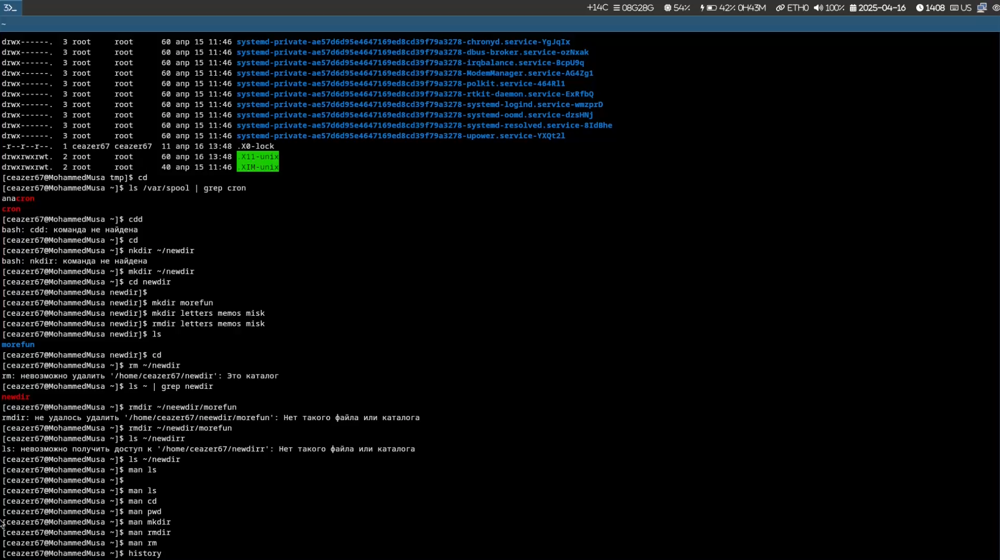
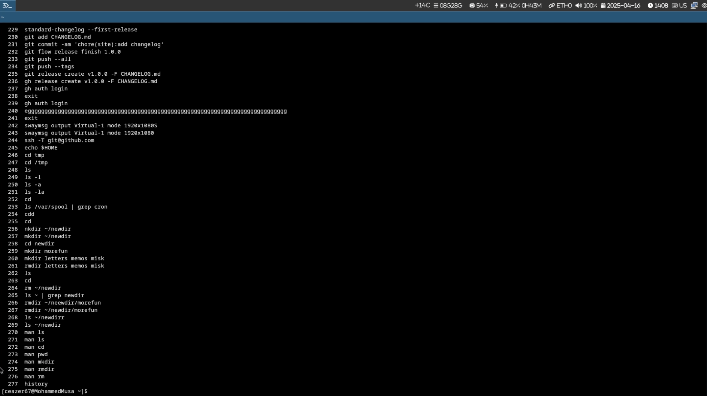

# Цель работы

Изучение базовых команд оболочки для работы с каталогами и файлами.

# Задание

1. Переход в каталог /tmp
2. Просмотр содержимого каталога /tmp
3. Проверка наличия подкаталога cron в /var/spool
4. Просмотр содержимого домашнего каталога
5. Создание и удаление каталогов
6. Использование опций команды ls
7. Работа с историей команд

# Переход в каталог /tmp

```bash  
cd /tmp  
```  


# Содержимое каталога /tmp

```bash  
ls -l      # подробный список с правами доступа  
ls -a      # показывает скрытые файлы  
ls -la     # комбинация предыдущих опций  
```  


# Проверка наличия подкаталога cron

```bash  
ls -l /var/spool/cron  # подкаталог существует  
```  



# Создание и удаление каталогов

```bash  
mkdir newdir  
mkdir ~/newdir/morefun  
mkdir letters memos misk  
rmdir letters memos misk  
rm -r newdir  # удаление с подкаталогами  
```  

# Опции команды ls

```bash  
ls -R  # рекурсивный вывод содержимого каталогов  
ls -lt  # сортировка по времени последнего изменения  
ls -l --time-style=+%H:%M  
```  

# Основные команды

```bash  
man cd    # смена текущего каталога  
man pwd   # вывод полного пути текущего каталога  
man mkdir # создание каталогов (-p для вложенных)  
man rmdir # удаление пустых каталогов  
man rm    # удаление файлов и каталогов (-r для рекурсивного удаления)  
```  

# Работа с историей команд

```bash  
history | tail -n 10  
!123     # повтор команды под номером 123  
!!       # повтор последней команды  
```  

  
  


# Выводы

Освоены базовые команды работы с файловой системой:  
- Навигация: `cd`, `pwd`  
- Просмотр содержимого: `ls` с опциями `-l`, `-a`, `-R`, `-t`  
- Управление каталогами: `mkdir`, `rmdir`, `rm -r`  
- История команд: `history`, `!n`  

# Контрольные вопросы

1. **Что такое командная строка?**  
   Интерфейс для ввода команд в виде текстовых выражений.

2. **Как определить абсолютный путь текущего каталога?**  
   ```bash  
   pwd  
   ```  

3. **Как показать только типы файлов и их имена?**  
   ```bash  
   ls -l | awk '{print $1, $9}'  
   ```  

4. **Как отобразить скрытые файлы?**  
   ```bash  
   ls -a  
   ```  

5. **Как удалить файл и каталог?**  
   ```bash  
   rm file.txt  
   rm -r directory_name  
   ```  

6. **Как посмотреть историю команд?**  
   ```bash  
   history  
   ```  

7. **Как использовать историю для модифицированного выполнения?**  
   ```bash  
   !123:s/old/new/  
   ```  

8. **Пример запуска нескольких команд в одной строке**  
   ```bash  
   mkdir test && cd test || echo "Ошибка"  
   ```  

9. **Символы экранирования**  
   ```bash  
   echo "Hello \$USER"  # $USER не интерпретируется  
   ```  

10. **Информация ls -l**  
    Права, количество жестких ссылок, владелец, группа, размер, дата, имя.

11. **Относительный путь**  
    ```bash  
    cd labs/lab6  # относительно текущего каталога  
    cd ../../lab6 # относительный путь из подкаталога  
    ```  

12. **Информация об команде**  
    ```bash  
    man ls  
    ```  

13. **Автодополнение команд**  
    Клавиша `Tab` для автодополнения имен файлов/команд.
