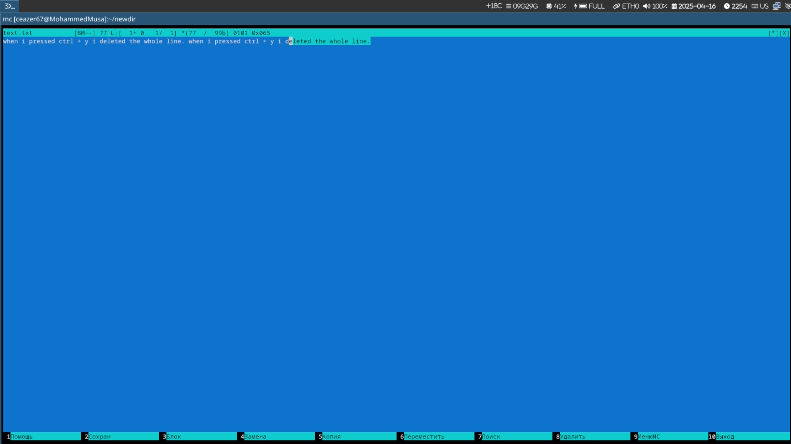

# Цель работы

Изучение возможностей Midnight Commander (mc) для работы с файлами, каталогами и встроенным редактором.

# Задание

1. Изучение Midnight Commander через man
2. Исследование интерфейса mc
3. Операции с файлами в mc
4. Использование меню панелей
5. Работа с подменю "Файл"
6. Использование подменю "Команда"
7. Настройки mc
8. Работа с встроенным редактором mc

# Изучение Midnight Commander

## Изучение mc через man

```bash
man mc
```

## Запуск mc и исследование интерфейса

```bash
mc
```

- Структура: две панели, строка меню, командная строка
- Меню: File, Command, Options, Right, Left, Info, Help


# Операции в mc

## Управление панелями

- `F9` → `Left/Right` → `List` → смена каталога
- Выделение файлов: `Insert` (для выделения), `F5` (копирование), `F6` (перемещение)
- Информация о файлах: `F10` → `Info` → `File` → `Properties`


# Использование меню панелей

## Операции с файлами

- Копирование файлов между панелями через `F5`
- Просмотр подробной информации: `F10` → `View` → `Long format`

# Подменю "Файл"

## Операции с файлами

- Просмотр содержимого: `F3` (View)
- Редактирование: `F4` (Edit) → внесение изменений без сохранения
- Создание каталога: `F7` → ввод имени
- Копирование файлов в новый каталог: выделение → `F5` → выбор целевого каталога

# Подменю "Команда"

## Поиск и выполнение команд

- Поиск файла с `main` в `.c`/`.cpp`: `F9` → `Command` → `Find file` → параметры: `*.c` и содержимое `main`
- Повтор команды: `F9` → `Command` → `History`
- Переход в домашний каталог: `F9` → `Command` → `Go to` → `Home`
- Анализ файлов меню: `F9` → `Command` → `Edit extension file`


# Настройки mc

## Интерфейс и отображение

- Режимы отображения: `F9` → `Options` → `Layout` → Full screen, Double width
- Отображение скрытых файлов: `F9` → `Options` → `Panel` → `Show hidden files`

# Встроенный редактор mc

## Создание и редактирование файлов

1. Создание файла:
   ```bash
   mc
   F9 → File → New file → text.txt
   ```

2. Редактирование через mc:
   - Вставка текста: `Ctrl+Ins` (копирование из другого файла)
   - Удаление строки: `Ctrl+Y`
   - Выделение фрагмента: `F3` (начало выделения) → `F3` (окончание) → `F5` (копирование) или `F6` (перемещение)
   - Сохранение: `F2`
   - Отмена: `Ctrl+U`
   - Навигация: `Alt+End` (в конец файла), `Alt+Home` (в начало)



# Подсветка синтаксиса

## Работа с кодом

- Открытие файла `.c`/`.java`: `F4` → выбор файла
- Включение/выключение: `F9` → `Options` → `Syntax highlighting`

# Выводы

В ходе работы освоены:
- Навигация и управление файлами в mc
- Поиск файлов с условиями через `Find file`
- Редактирование текста и кода с подсветкой синтаксиса
- Настройка интерфейса mc под задачи пользователя

# Контрольные вопросы

## 1. Режимы mc

- **Shell-режим**: Основной интерфейс с двумя панелями для навигации по файловой системе, строкой меню и командной строкой
- **Редактор**: Активируется через `F4`, поддерживает синтаксис подсветку, поиск/замена, отмену изменений (`Ctrl+U`)
- **Просмотр**: Активируется через `F3`, позволяет читать содержимое файлов без редактирования, поддерживает поиск (`F7`)

## 2. Операции с файлами

- **Копирование**: В mc `F5`, в shell `cp source destination`
- **Перемещение**: В mc `F6`, в shell `mv source destination`
- **Удаление**: В mc `F8`, в shell `rm file` или `rm -r directory`

## 3. Меню панели mc

- `Left/Right`: Переключение между панелями
- `Info`: Отображение метаданных файла
- `Help`: Справка по горячим клавишам
- `List`: Список файлов с фильтрацией
- `New`: Создание новых файлов/каталогов
