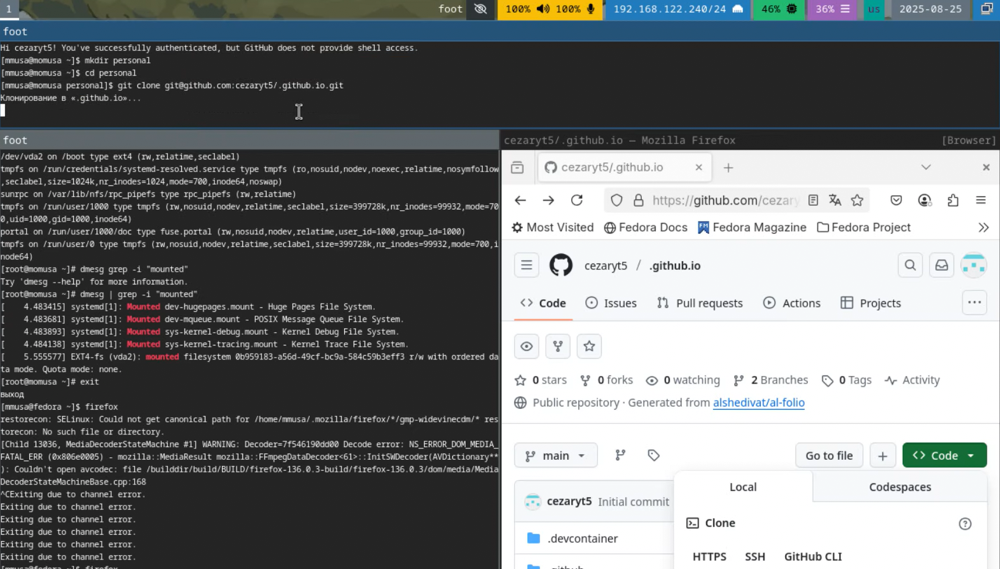
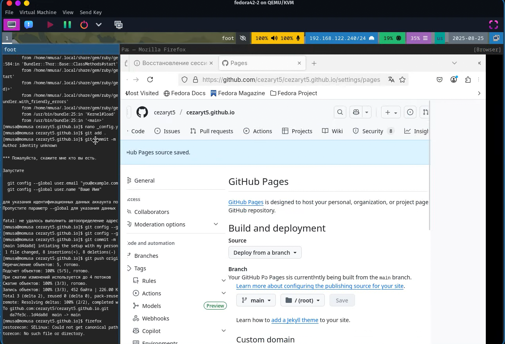
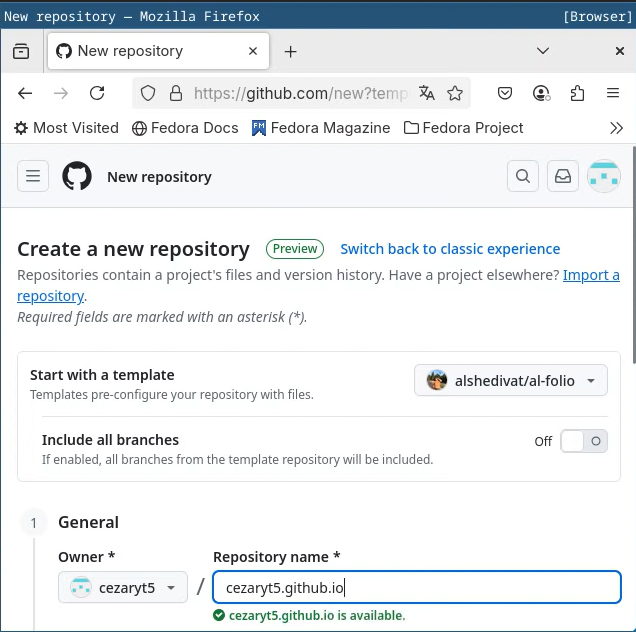
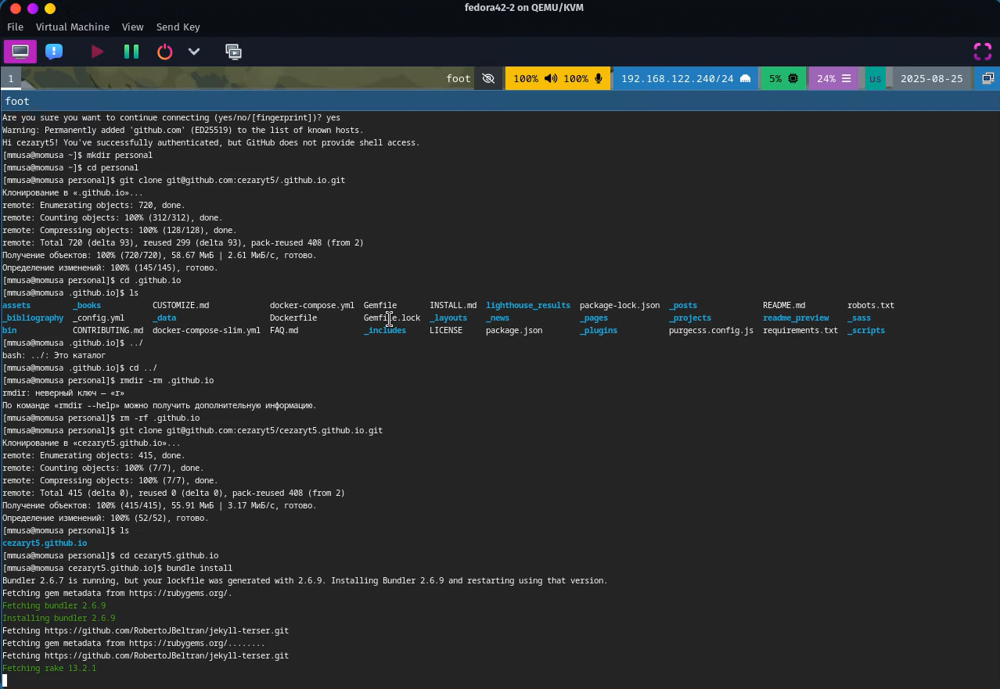
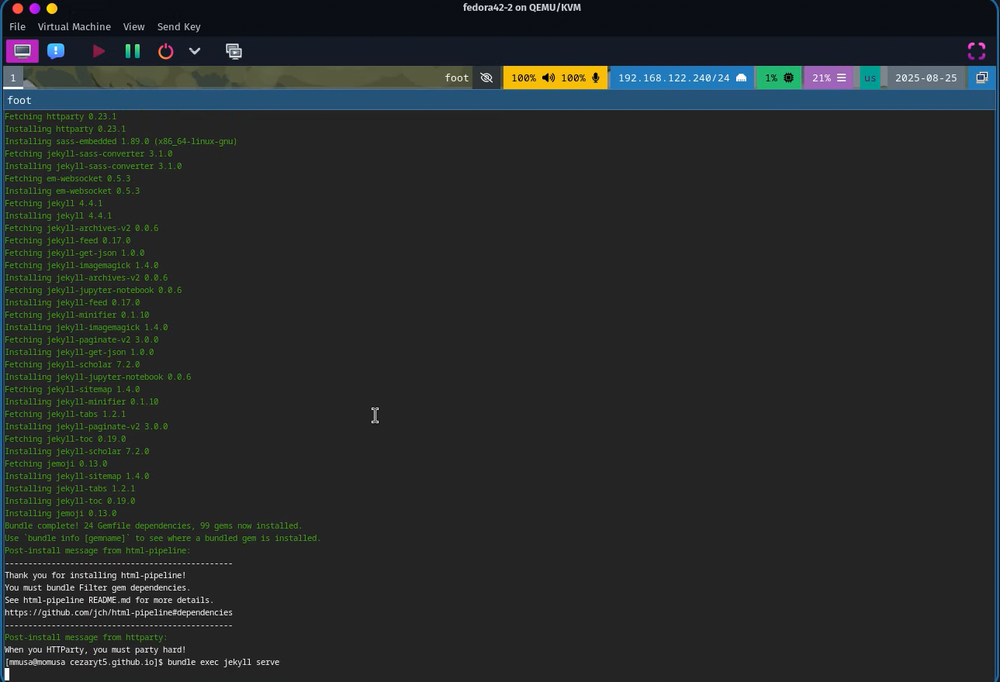
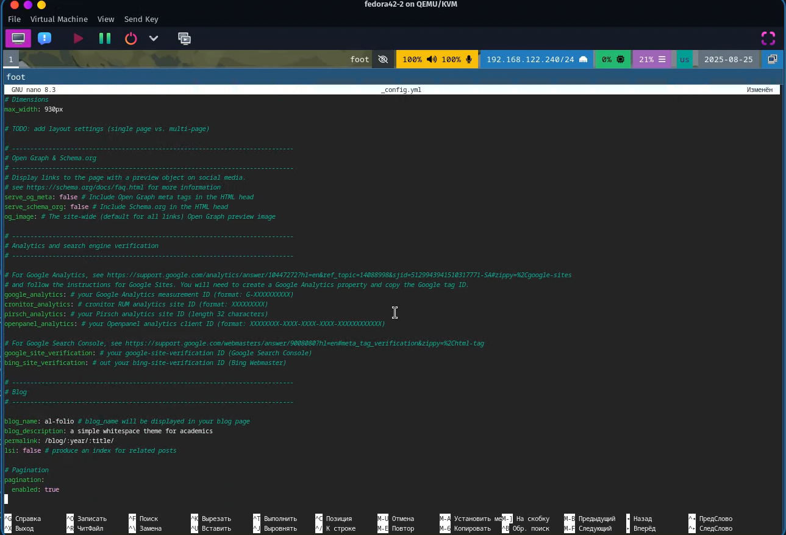
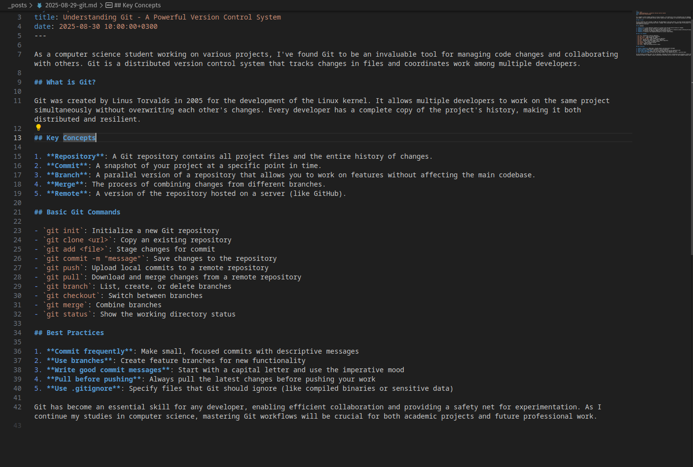
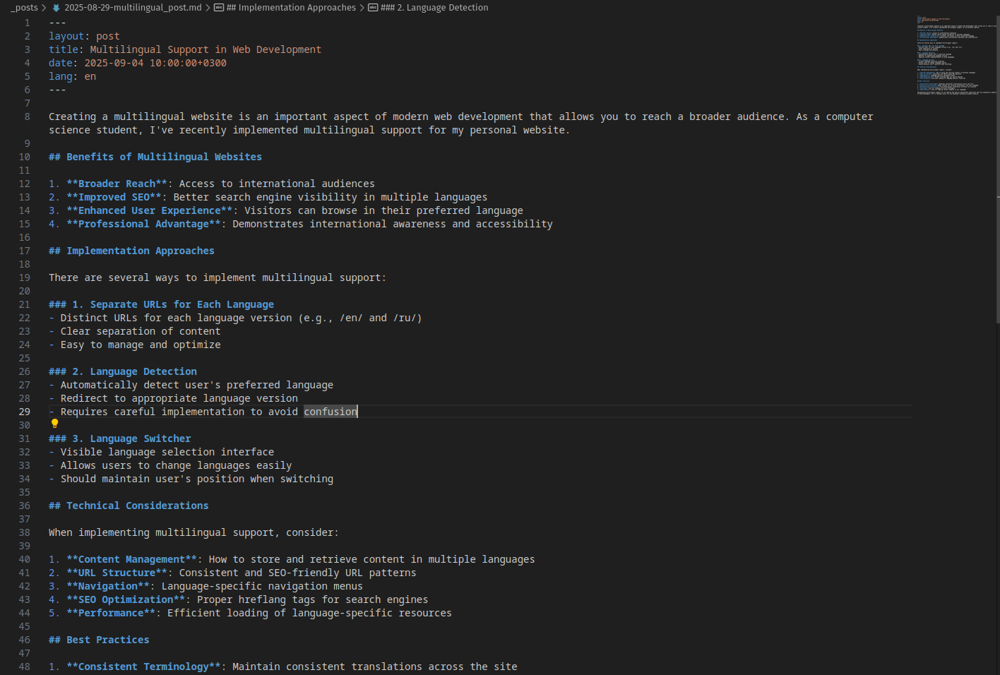
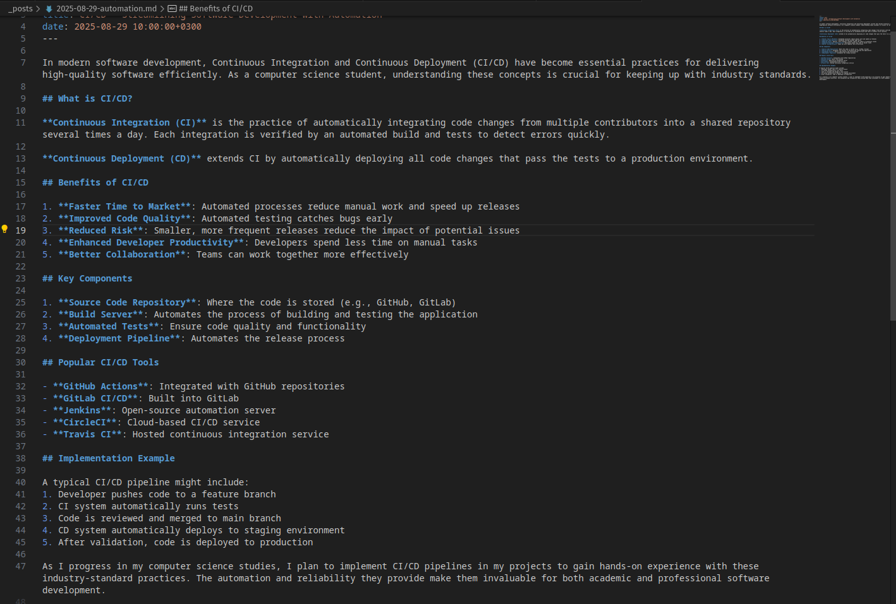

---
## Front matter
title: "Отчёт по завершение индивидуального проекта"
subtitle: "Дисциплина: Архитектура компьютеров и операционные системы"
author: "Мохамед Муса"

## Generic otions
lang: US-RU
toc-title: "Содержание"

## Bibliography
bibliography: bib/cite.bib
csl: pandoc/csl/gost-r-7-0-5-2008-numeric.csl

## Pdf output format
toc: true # Table of contents
toc-depth: 2
lof: true # List of figures
fontsize: 12pt
linestretch: 1.5
papersize: a4
documentclass: scrreprt
## I18n polyglossia
polyglossia-lang:
  name: russian
  options:
  - spelling=modern
  - babelshorthands=true
polyglossia-otherlangs:
  name: english
## I18n babel
babel-lang: russian
babel-otherlangs: english
## Fonts
mainfont: PT Serif
romanfont: PT Serif
sansfont: PT Sans
monofont: PT Mono
mainfontoptions: Ligatures=TeX
romanfontoptions: Ligatures=TeX
sansfontoptions: Ligatures=TeX,Scale=MatchLowercase
monofontoptions: Scale=MatchLowercase,Scale=0.9
## Biblatex
biblatex: true
biblio-style: "gost-numeric"
biblatexoptions:
  - parentracker=true
  - backend=biber
  - hyperref=auto
  - language=auto
  - autolang=other*
  - citestyle=gost-numeric
## Pandoc-crossref LaTeX customization
figureTitle: "Рис."
listingTitle: "Листинг"
lofTitle: "Список иллюстраций"
lolTitle: "Листинги"
## Misc options
indent: true
header-includes:
  - \usepackage{indentfirst}
  - \usepackage{float} # keep figures where there are in the text
  - \floatplacement{figure}{H} # keep figures where there are in the text
---

# Цель работы
создание портфолио. 

## Задание
1. Клонирование шаблона сайта
2. редактирование сайта

### 1. Клонирование шаблона сайта
- На этом этапе я создал репозиторий из шаблона al-folio.git и подготовил его к развертыванию на бесплатном веб-хостинге GitHub, следуя его правилам.

```bash
git clone https://github.com/alshedivat/al-folio.git
```




- A также запустить сборщик команд, чтобы страница была готова.

```bash
bundle install
bundle exec jekyll serve
```



### редактирование сайта

- Добавлена конфигурация многоязычной поддержки в `_config.yml`
- Настроены языки: английский (по умолчанию) и русский


#### Новые страницы
- Создана русская версия страницы "О себе": `_pages/ru/about_ru.md`
- Обновлена навигация для поддержки переключения языков

#### Блог посты
- Создан многоязычный блог пост с версиями на английском и русском языках:
  - Английский: `_posts/2025-08-29-multilingual_post.md`
  - Русский: `_posts/2025-08-29-multilingual_post_ru.md`

### 2. Новые технические блог посты

Добавлены три новых технических блог поста:

1. **Лучшие практики Git**
   - Файл: `_posts/2025-08-29-git.md`
   - Контент охватывает основные рабочие процессы и команды Git

2. **Техники автоматизации**
   - Файл: `_posts/2025-08-29-automation.md`
   - Контент обсуждает различные подходы к автоматизации для рабочих процессов разработки

3. **Руководство по LaTeX**
   - Файл: `_posts/2025-08-29-latex.md`
   - Контент предоставляет комплексное руководство по LaTeX для академического письма




### 3. Другие обновления

- Изменены данные резюме в `_data/cv.yml`
- Обновлены ссылки на социальные сети в `_data/socials.yml`

## Детали реализации

### Многоязычные функции
Реализация многоязычности следует стандартному подходу Jekyll:
- Страницы на определенном языке организованы в подкаталогах (например, `/ru/`)
- Блог посты используют суффиксы языков в именах файлов для переводов
- Навигация включает возможности переключения языков

### Технический контент
Новые блог посты сосредоточены на технических темах, актуальных для академической работы:
- Система контроля версий Git для научного сотрудничества
- Инструменты автоматизации для повышения производительности
- LaTeX для подготовки академических документов
